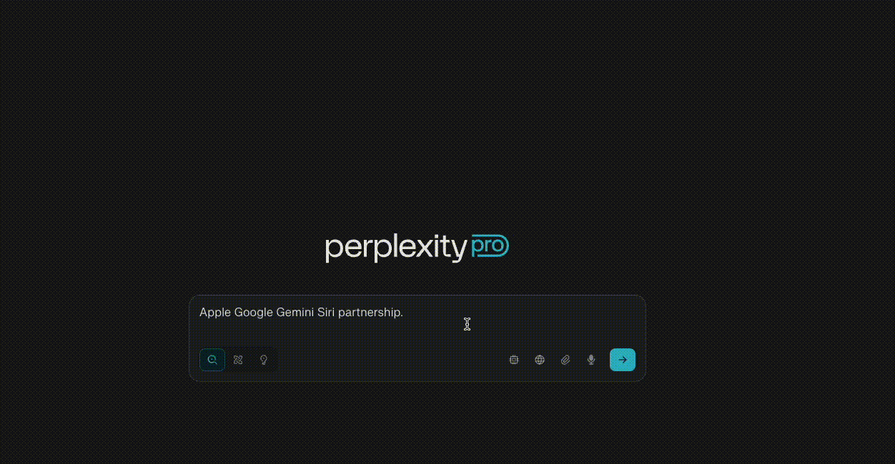
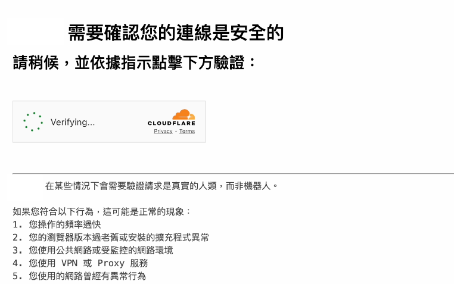

### 前言

在 8 月 4 日，Cloudflare 發表文章譴責 Perplexity「[stealth, undeclared crawlers to evade website no-crawl directives](https://blog.cloudflare.com/perplexity-is-using-stealth-undeclared-crawlers-to-evade-website-no-crawl-directives/)」。同一天，Perplexity 也發表了[回應](https://www.perplexity.ai/hub/blog/agents-or-bots-making-sense-of-ai-on-the-open-web)，指出 Cloudflare 誤解了 AI 代理的運作方式。這場爭議不僅是兩家公司之間的衝突，也凸顯了 AI 服務提供商與內容創作者之間日益增加的緊張關係。

{/* truncate */}

### Perplexity 是什麼？

[Perplexity](https://www.perplexity.ai/) 提供 AI 問答。與 ChatGPT 類似，它幾乎可以回答任何問題。當模型本身沒有足夠的 Per-Trained 知識時，Perplexity 會即時「搜尋」網路，以提供更準確、最新的答案。

### Cloudflare 是什麼？

[Cloudflare](https://www.cloudflare.com/) 是一家提供 CDN 服務的公司，旨在提升網站效能並保障安全。以往用戶會直接連線至網站伺服器，但這可能導致連線速度慢，並且容易受到 DDoS 攻擊等威脅。

Cloudflare 作為 **反向代理 (reverse proxy)**，位於用戶與原始伺服器之間。它從全球伺服器提供內容以降低延遲，並阻擋異常或惡意流量。

當你訪問受 Cloudflare 保護的網站時，可能會看到類似的頁面：

這表示 Cloudflare 正在評估請求，以決定是否允許，從而保護網站安全。

### 防火牆與爬蟲

網站的訪問者不僅有人類，還有各種爬蟲。像 Googlebot 這樣的爬蟲會為搜尋引擎建立索引——這對網站有好處。反之則為「惡意爬蟲」，可能會以不當方式抓取內容。

Cloudflare 的 **Web Application Firewall (WAF)** 能區分「善意」與「惡意」爬蟲 (Good/Bad Bots)。允許 Good Bot 訪問，阻擋 Bad Bot，讓網站擁有者可以控制內容存取。

### AI 與「竊取 (steeling) vs. 索引 (Indexing)」的爭議

以往，創作者喜歡爬蟲，因為透過廣告，搜尋引擎能為網站帶來流量與收入。然而 AI 的出現改變了這種模式：AI 可以直接回答用戶問題，而無需引導流量到原始內容。這讓內容創作者對「竊取」與「索引」之間的界線產生疑慮。

### Cloudflare 的指控

在其文章 **[Perplexity is using stealth, undeclared crawlers to evade website no-crawl directives](https://blog.cloudflare.com/perplexity-is-using-stealth-undeclared-crawlers-to-evade-website-no-crawl-directives/)** 中，Cloudflare 指出 Perplexity 違反 Web 標準：

1. **忽略 `robots.txt` 指令**\
   網站擁有者可以透過 `robots.txt` 要求爬蟲避免特定頁面。善意的爬蟲會遵守指令；惡意的爬蟲則會無視。Cloudflare 發現 Perplexity 的爬蟲有時會在 `robots.txt` 設置禁止抓取的情況下仍進行訪問。

2. **試圖隱藏身分**\
   合法爬蟲會在 `User-Agent` 標頭中表明自己的身份。惡意爬蟲可能偽裝成瀏覽器，以避開 WAF 的防護。Cloudflare 報告指出，Perplexity 的爬蟲有時會偽裝成 macOS 上的 Chrome，讓它看起來像是人類訪問網站。

Cloudflare 因此判定 Perplexity 的爬蟲為 **惡意爬蟲**，並將其從已驗證的爬蟲清單移除，使其請求被 WAF 阻擋。

### Perplexity 的回應

被 Cloudflare 阻擋會使 Perplexity 無法訪問使用 Cloudflare 的網站。對此 Perplexity 在 [Agents or Bots? Making Sense of AI on the Open Web](https://www.perplexity.ai/hub/blog/agents-or-bots-making-sense-of-ai-on-the-open-web) 中表示，AI 代理的運作方式不同於傳統爬蟲：

- 統爬蟲會抓取並儲存內容以建立索引，而 Perplexity 僅在用戶提出查詢時抓取內容，並不永久儲存。
- 當代表用戶抓取內容時，AI 代理的行為更像是用戶主動請求，而非自動化爬蟲。

Perplexity 提出了一個重要問題：如果 AI 只是依用戶需求抓取內容，它應該被視為爬蟲機器人嗎？

### 結論

雖然 Perplexity 並未明確表示其會始終遵守傳統爬蟲規則，但其論點提供了新的觀點：AI 代理可能無法簡單地劃分為「善意爬蟲/惡意爬蟲」。若他們的 AI 系統能如 [Perplexity 文件](https://docs.perplexity.ai/guides/bots) 所述聲明身份，內容創作者便可以做出知情決策，決定是否允許 AI 訪問。

### 參考資料

- [Cloudflare Blog: Perplexity is using stealth, undeclared crawlers to evade website no-crawl directives](https://blog.cloudflare.com/perplexity-is-using-stealth-undeclared-crawlers-to-evade-website-no-crawl-directives/)
- [Perplexity: Agents or Bots? Making Sense of AI on the Open Web](https://www.perplexity.ai/hub/blog/agents-or-bots-making-sense-of-ai-on-the-open-web)
- [Perplexity Crawlers Documentation](https://docs.perplexity.ai/guides/bots)
