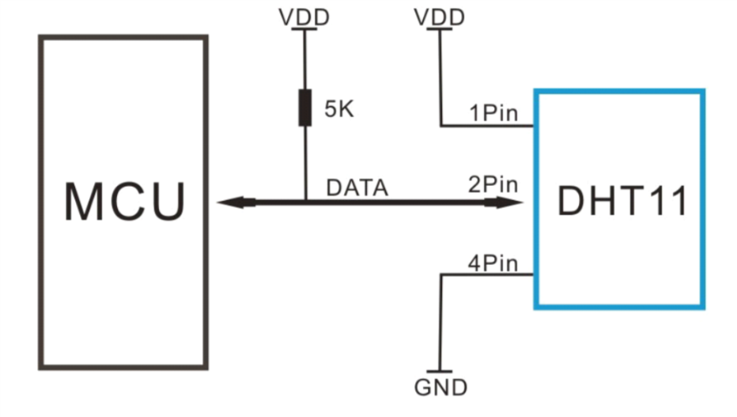
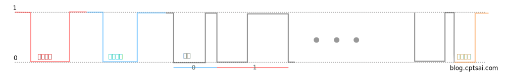
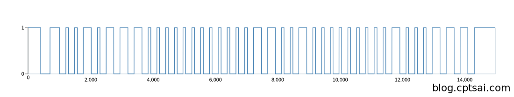
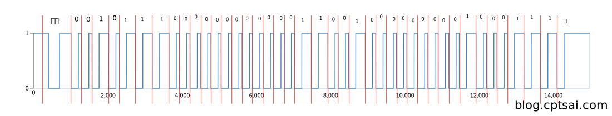

## 前言

剛入門單晶片時，讀取溫度感測器是很多新手第一個實作目標，網路上也有很多 [Library](https://github.com/adafruit/DHT-sensor-library) 可以直接使用。也因為如此，我一直沒弄清楚單晶片和感測器是如何溝通的，這幾天剛好想使用 Node Js 來接，稱這個機會好好了解通訊原理吧！

<!--truncate-->

## 基本資訊

會挑選 DHT11 來深入研究是因為他是個很多人在使用的模組，規格書也相對完整許多，很適合新手閱讀 XD，這篇文章會以 [這份](http://www.micropik.com/PDF/dht11.pdf) 規格書來講解。

<figure>



<figcaption>圖片來自 http://www.micropik.com/PDF/dht11.pdf</figcaption>
</figure>

DHT11 的 1、4 號角位分別接上 VDD 和接地，2 號腳位是和 MCU 通訊用的雙向傳輸通道，3 號角位是沒有用處的。

## 資料格式

一次的資料傳輸會有 `40bit` 的資料，依照順序分別代表：


這個範例代表的是
濕度 00110101 = 53 %
溫度 00011000 = 24 度 C
檢查碼是用來確定傳輸資料正確性的，他應該要等於前面資料相加取後 8bit，例如上面範例 00110101 + 00011000 = 01001101 (符合)

:::tip
當檢查碼不符合時，我們應該放棄本次傳輸的資料，再要求一次

:::

## 要求資料

DHT11 沒事不會一直送資料，所以只接受腳位的輸入是沒辦法拿資料的，我們必須傳送一個 `起始訊號` 給 DHT11，當他接受到訊號時，便會由低功耗模式轉為運作模式，訊號結束後就會回應資料給 MCU，整個傳輸流程如下



最前面的訊號事就是起始訊號，是由 MCU 發出的，將原本的高電位拉低大約 18 ms 後回到高電位，接著把控制權交給 DHT11，使用 [RPIO](https://github.com/jperkin/node-rpio) 程式可以這麼寫：

```javascript
// 輸出模式
rpio.open(pin, rpio.OUTPUT);
先回復成高電位;
rpio.write(pin, rpio.HIGH);
rpio.msleep(500);
// 拉低
rpio.write(pin, rpio.LOW);
// 經過特定時間 (這裡應該要是 18ms，但 JS 實際會有延遲，得時測之後才在修改這個值)
rpio.msleep(2);
// 回復成高電位
rpio.write(pin, rpio.HIGH);
// MCU 轉為輸入模式，接聽 DHT11 的回應
rpio.mode(pin, rpio.INPUT);
```

到這裡我們就完成起始訊號的發送了，接下來是接受回應訊號和資料的部分，為了避免 JS 延遲，會使用 `readBuf` 這個方法來取代由 JS 不斷的讀取資料。

```javascript
const buf = new Buffer(100000);
rpio.readbuf(pin, buf);
```

:::tip
Buffer 大小只需要能完整接受接下來的訊號就好

:::

## 解析回應

Buffer 拿到的結果長這個樣子


中間的部分就是資料的回應，由於每次讀取的速度都不太一樣，所以我的 Buffer 取得比較大一些。把中間部分訊號放大來看的話



前後為起始、結束訊號，中間資料部分每個拉底拉高為一個 bit，低電位的時間都為 50 us，高電位時間 26us 代表 bit 0，70 us 代表 bit 1，如下面這張圖


試著把所有訊號分割來看



得到
00101110 = 46 (濕度)
00000000
00011001 = 25 (溫度)
00000000
01000111 = 71 (檢查 46 + 25 = 71)
我們雖然不能確定訊號持續多久，但能利用訊號取樣的長度來做簡單的判斷，當高電位長度大於低電位時為 1 ，反之則為 0。

```javascript
let last = 1;
let count = 0;
let start = 3; // 略過前三個變化
let data = [];
for (let b of buf) {
  if (last === b) {
    count++;
  } else {
    if (start > 0) {
      start--;
    } else {
      data.push({
        level: last,
        len: count,
      });
    }
    last = b;
    count = 0;
  }
}
if (data.length > 80) {
  let trea = data[0].len;
  let hi = "";
  for (let i = 0; i < 8; i++) {
    hi += data[2 * i + 1].len > trea ? "1" : "0";
  }
  let hd = "";
  for (let i = 8; i < 16; i++) {
    hd += data[2 * i + 1].len > trea ? "1" : "0";
  }
  let ti = "";
  for (let i = 16; i < 24; i++) {
    ti += data[2 * i + 1].len > trea ? "1" : "0";
  }
  let td = "";
  for (let i = 24; i < 32; i++) {
    td += data[2 * i + 1].len > trea ? "1" : "0";
  }
  let ck = "";
  for (let i = 32; i < 40; i++) {
    ck += data[2 * i + 1].len > trea ? "1" : "0";
  }

  const deg = parseInt(ti, 2); // 溫度整數
  const hum = parseInt(hi, 2); // 濕度整數
  const degdot = parseInt(td, 2); // 溫度小數
  const humdot = parseInt(hd, 2); // 濕度小數

  const check = parseInt(ck, 2);
  if (deg + hum + degdot + humdot === check) {
  }
}
```

到這裡就可以取得 DHT11 的溫溼度囉，有任何問題歡迎聯絡我！

## 參考資料

- [DHT11 DataSheet](http://www.micropik.com/PDF/dht11.pdf)
- [DHT11 DataSheet 2](http://wiki.seeedstudio.com/images/3/31/DHT11.pdf)
