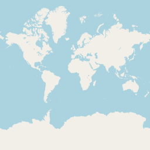

最近開了個新坑，因為想要用自己的資料來製作線上地圖，Google Maps 等服務能自訂的項目並沒有很多，這個系列的文章會在沒有依賴外部服務的狀態下（當然圖資還是得由供應商取得），建立自己的地圖，包含後端的圖資料庫以及前端的渲染。

{/* truncate */}

import MapTiler from '../_maptiler';

<MapTiler url="https://api.maptiler.com/maps/770b1ea1-dd5c-4faa-bac0-9568babe7c12/?key={key}#5.5/23.78510/121.26366" width="100%" />

## 圖磚系統

地球是圓的，想要把它繪製在一個 2D 的平面上，必須要經過投影，目前比較常見的是[麥卡托投影法](https://www.wikiwand.com/zh-tw/%E9%BA%A5%E5%8D%A1%E6%89%98%E6%8A%95%E5%BD%B1%E6%B3%95)的其中一種 [EPSG:3857](https://epsg.io/3857)，Google Map 和 OpenStreetMap 目前都是使用這種投影方式。

投影在平面之後接下來就是怎麼樣顯示在網頁上了，世界這麼大，不可能一次給你一張大地，裡面包含了所有東西，但我們可以把地圖切成一塊一塊的圖磚 (Tiles)，等到需要的時候再下載，比如說拉動到某個地區，縮放到某個程度等等。

圖磚系統包含了三個參數: Zoom, X, Y

Zoom 表示縮放等級，從 0 開始代表把世界切成 2^0 x 2^0 = 1 個圖磚，所以 Z=0, X=0, Y=0 得圖磚長這樣：

圖片來自 OpenStreetMap

## 參考資料
- [Vector tiles introduction - Mapbox](https://docs.mapbox.com/data/tilesets/guides/vector-tiles-introduction/)

import GisSeries from "../_gis-series.mdx";

<GisSeries />
