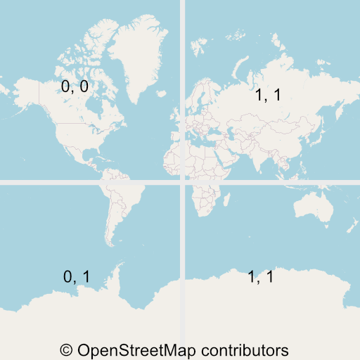

最近開了個新坑，因為想要用自己的資料來製作線上地圖，Google Maps 等服務能自訂的項目並沒有很多，這個系列的文章會在沒有依賴外部服務的狀態下（當然圖資還是得由供應商取得），建立自己的地圖，包含後端的圖資料庫以及前端的渲染。

import GisSeries from "../_gis-series.mdx";

<GisSeries />

{/* truncate */}

import MapTiler from '../_maptiler';

<MapTiler url="https://api.maptiler.com/maps/770b1ea1-dd5c-4faa-bac0-9568babe7c12/?key={key}#5.5/23.78510/121.26366" width="100%" />

## 圖磚系統


地球是圓的，想要把它繪製在一個 2D 的平面上，必須要經過投影，目前比較常見的是[麥卡托投影法](https://www.wikiwand.com/zh-tw/%E9%BA%A5%E5%8D%A1%E6%89%98%E6%8A%95%E5%BD%B1%E6%B3%95)的其中一種 [EPSG:3857](https://epsg.io/3857)，Google Map 和 OpenStreetMap 目前都是使用這種投影方式。

投影在平面之後接下來就是怎麼樣顯示在網頁上了，世界這麼大，不可能一次給你一張大地圖，裡面包含了所有東西，但我們可以把地圖切成一塊一塊的圖磚 (Tiles)，等到需要的時候再下載，比如說拉動到某個地區，縮放到某個程度等等。

圖磚系統包含了三個參數: Zoom, X, Y

Zoom 表示縮放等級，從 0 開始代表把世界切成 2^0 x 2^0 = 1 個圖磚，所以 Z=0, X=0, Y=0 得圖磚長這樣：


Zoom = 1 則有 2^1 x 2^1 = 4 個圖磚，每個圖磚的大小是相同的，通常是 256px 的正方形，所以切割成越多的圖磚能有更高的解析度：



分割越細的圖磚可以顯示更多細節，這是 Z = 19, X = 439151, Y = 224548 的樣子


有了圖磚之後，客戶端只需要依照縮放等級以及目標位置，取得這些圖片，然後把它們組合起來就是基本的線上地圖了！
目前有很多圖磚的提供者，比如由社群貢獻的 OpenStreetMap。

我們可以藉由這個網址來取得圖磚檔案:
```
https://tile.openstreetmap.org/{z}/{x}/{y}.png
```

:::note
使用 OpenStreetMap 資料請遵守其政策：https://operations.osmfoundation.org/policies/tiles/
:::

## Vector Tiles
傳統的地圖確實就是由伺服器取得這些圖片組合成地圖的，不過隨著客戶端的效能越來越好，目前主流的地圖漸漸改用客戶端渲染這些圖片，我覺得有點像前端由 Server side render 轉為 Client side render 一樣的感覺。這個系列的文章也會使用 Vector Tiles。

伺服器端不再提供完整的圖片，而是告訴你這個區塊內有甚麼東西，以及 Style 定義，比如說海應該是藍色的，路應該是灰色的等等，由客戶端（網頁、Naitve APP）決定要怎麼繪製地圖。

這樣有很多好處，像是：
- 動態產生地圖：客戶端可以決定要怎麼繪製，比如說可以改成符合 Dark Mode 的地圖，隱藏某些物件等等。
- 減少伺服器負擔：Z = 19 時，全世界會有 2749 億個圖磚，這些圖片不可能永遠都快取在伺服器，只能在收到要求的時候繪圖，這樣反應速度會慢許多。
- 減少流量

舉例來說，伺服器不會直接把「民權路」畫出來，而是告訴客戶端：這個圖磚內有一條路，它叫做民權路，路的等級是 tertiary。


客戶端再依據 Style 定義來繪圖：
```json
{
  "id": "road_secondary_tertiary",
  "type": "line",
  "source": "openmaptiles",
  "source-layer": "transportation",
  "filter": [
    "all",
    ["in","class","secondary","tertiary"]
  ],
  "layout": {
    "line-cap": "round",
    "line-join": "round"
  },
  "paint": {
    "line-color": "#fea",
  }
}
```

畫一條黃色的路線


## 總結
這篇文章就以介紹圖磚系統為主，接下來的文章中，我會介紹如何準備圖資、定義 Style、傳送圖磚資料、渲染地圖等等。

<GisSeries />

## 參考資料
- [Vector tiles introduction - Mapbox](https://docs.mapbox.com/data/tilesets/guides/vector-tiles-introduction/)
