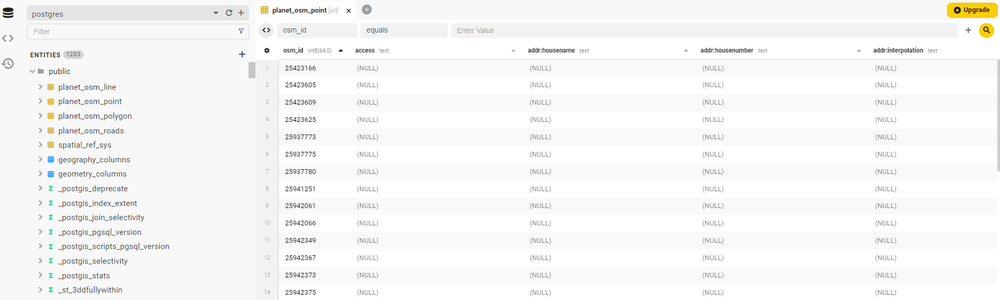
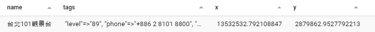

這篇文章會把 OpenStreetMap 的圖資資料載入 Postgres 資料庫中，以利我們後續建立 Tile Server 使用。

## OpenStreetMap 資料
[OpenStreetMap](https://www.openstreetmap.org/#map=16/24.9878/121.5358)(OSM) 是開放授權的開源圖資，像 Wikipedia 一樣，任何人都可以編輯貢獻資料。只要在您的服務中標明資料來源，OSM 的資料是基於 [ODbL](https://www.openstreetmap.org/copyright) 免費使用的。

OSM 的資料包含 nodes (建築、出入口等等)、ways (路線、區域等等)以及 relations。例如下面這是中山南路的其中一段資料，他表明了路線經過的點(nodes)，以及這段路線的名稱，路線種類等等。

{/* truncate */}
```xml
 <way id="6183255" visible="true" version="32" changeset="120890621" timestamp="2022-05-12T13:45:49Z" user="user_xxxxx" uid="xxxxx">
  <nd ref="9402564710"/>
  <nd ref="1505012069"/>
  <nd ref="1505012053"/>
  <nd ref="5246621631"/>
  <nd ref="9402530955"/>
  <tag k="highway" v="primary"/>
  <tag k="lanes" v="2"/>
  <tag k="lit" v="yes"/>
  <tag k="moped" v="no"/>
  <tag k="name" v="中山南路"/>
  <tag k="name:en" v="Zhongshan South Road"/>
  <tag k="name:etymology" v="孫中山"/>
  <tag k="name:etymology:wikidata" v="Q8573"/>
  <tag k="name:etymology:wikipedia" v="zh:孫中山"/>
  <tag k="name:nan" v="Tiong-san-lâm-lō͘"/>
  <tag k="name:nan-POJ" v="Tiong-san-lâm-lō͘"/>
  <tag k="name:nan-TL" v="Tiong-san-lâm-lōo"/>
  <tag k="name:zh" v="中山南路"/>
  <tag k="oneway" v="yes"/>
  <tag k="ref" v="9"/>
  <tag k="ref:en" v="Provincial Highway 9"/>
  <tag k="ref:zh" v="台9線"/>
  <tag k="surface" v="asphalt"/>
 </way>
```

目前(2024一月) OSM的資料大約有 1839 GB，如果您只需要一部分的資料，比如說台灣地區的資料，可以到 [geofabrik.de](https://download.geofabrik.de/asia/taiwan.html) 下載，檔案會是 [PBF](https://wiki.openstreetmap.org/wiki/PBF_Format) 壓縮格式。這個 Server 會每天下載新的 OSM 資料並且按照地區來壓縮。

## PostGIS
有了地圖原始資料後，下一步是把它存到 Database 中，這篇文章我們使用 [PostGIS](https://postgis.net/)，您也可以選擇其他 DB。PostGIS 為 PostgreSQL 的一個 extension，他提供很多 GIS 相關的函式、Index 等等功能。

請參考其官方文件來安裝 PostGIS 到您的 PG Database 中，或是直接使用 Docker image。

```bash
# For demo only, should not be used in production.
docker run --rm -p 5432:5432 -e POSTGRES_HOST_AUTH_METHOD=trust postgis/postgis:16-3.4
```

## osm2pgsql
有了支援地理系統的資料庫後，我們還需要一個工具把 OSM 的原始資料放入 DB 中，這裡我們選用 [osm2pgsql](https://osm2pgsql.org/)，他是專門用來將 OSM 資料導入 PG 的。依照官方文件安裝完成後，只用下面的指令來載入資料：

```bash
osm2pgsql -G --hstore -d postgres -U postgres -H localhost -P 5432 ./taiwan-latest.osm.pbf
```

:::info
您可能需要安裝額外的 Extension 來支援 hstore:
```sql
CREATE EXTENSION hstore;
```
:::

導入完成後，Database 中應該會有四張 `planet_osm` 開頭的表, 包含大約 660 萬個 Points：


您可以試著找找「台北 101 觀景台」的資料，包含名稱、tags、和座標：
```sql
SELECT
  name,
  tags,
  ST_X(way) as x,
  ST_Y(way) as y
FROM
  planet_osm_point
WHERE
  osm_id = 4584957701
```


## SRID
您應該可以發現，資料中的座標並不是我們熟悉經緯度，那是因為投影座標系統的差異。
您可以藉由下面的 SQL 來取得目前資料庫中資料的座標系統：
```sql
SELECT ST_SRID(way) FROM planet_osm_point WHERE osm_id = 4584957701;
-----------

st_srid 
---------
3857
```
目前資料庫中的資料應該是 [EPSG:3857](https://epsg.io/3857)，單位為公尺，這是地圖中很常使用的座標系統，我們的圖磚伺服器也將使用他。我們可以很容易地使用 PostGIS 的函式來轉換座標系統，比如我們熟悉的 GPS 經緯度 [EPSG:4326](https://epsg.io/4326):
```sql
SELECT
  ST_X(latlng),
  ST_Y(latlng)
FROM
  planet_osm_point,
  ST_Transform(way, 4326) AS latlng
WHERE
  osm_id = 4584957701;
---
st_x         |       st_y        
---------------------------------
 121.5648104 | 25.03352480025512
```

## 建立 Index
在圖磚系統中，我們很常使查詢兩個點是否交會，比如說 z=18 x=219591 y=112232 的圖磚中包含哪些點。我們先來看個簡單的例子：
查詢台北101附近100公尺的點：
```sql
WITH taipei_101 AS (
  SELECT ST_Buffer(way, 100) AS way FROM planet_osm_point WHERE osm_id = 4584957701 LIMIT 1
  --- 以台北101 為圓心畫出半徑100公尺的圓
)
SELECT
  name
FROM
  planet_osm_point,
  taipei_101
WHERE
ST_Intersects(taipei_101.way, planet_osm_point.way)
--- 找出和剛剛畫出的圓交會的點

----
->  Seq Scan on planet_osm_point  (cost=0.00..364420.39 rows=6605239 width=47) (actual time=0.042..882.363 rows=6605239 loops=1)

```
在沒有 Index 的情況下，DB Scan 了所有的 Rows (600 多萬筆資料) 才能得到結果，花費了 2.56 秒，這在大量的查詢下會是個災難，我們需要對地理資訊建立 Index。

:::info
osm2pgsql 預設會幫您建立 Index: "planet_osm_point_way_idx" gist (way) WITH (fillfactor='100')，您可以沿用這個 Index 就好。
:::

[Spatial Indexing](https://postgis.net/workshops/postgis-intro/indexing.html) 和一般的 Index 不同，他先畫出 bounding boxes，存入 R-Tree 中`, 藉此來快速的找到交會的點。

```sql
--- 建立 Spatial Indexing
CREATE INDEX planet_osm_point_way ON planet_osm_point USING GIST (way);
--- 重複剛剛的 Query
->  Index Scan using planet_osm_point_way on planet_osm_point  (cost=0.41..10934.48 rows=661 width=47) (actual time=0.109..0.263 rows=208 loops=1)
```
建立 Index 後，同樣的查詢只花 0.068 秒。

## 海洋及湖泊資料
OSM 資料並沒有包含海洋和湖泊，如果您需要的話，可以在 [Water polygons](https://osmdata.openstreetmap.de/data/water-polygons.html) 下載並導入資料庫。

## 總結
到此我們已經準備好所需的資料了，下一步我們將建立 Tile Server。


import GisSeries from "../_gis-series.mdx";

<GisSeries />

## 參考資料
- [Elements - OSM Wiki](https://wiki.openstreetmap.org/wiki/Elements)