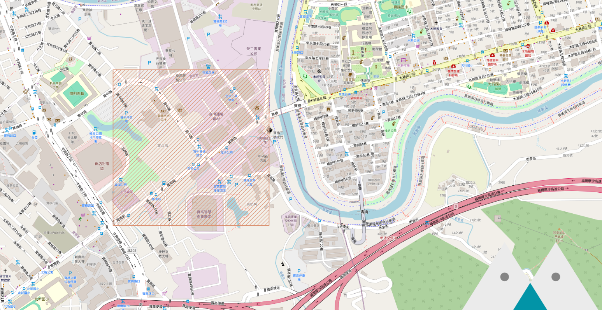
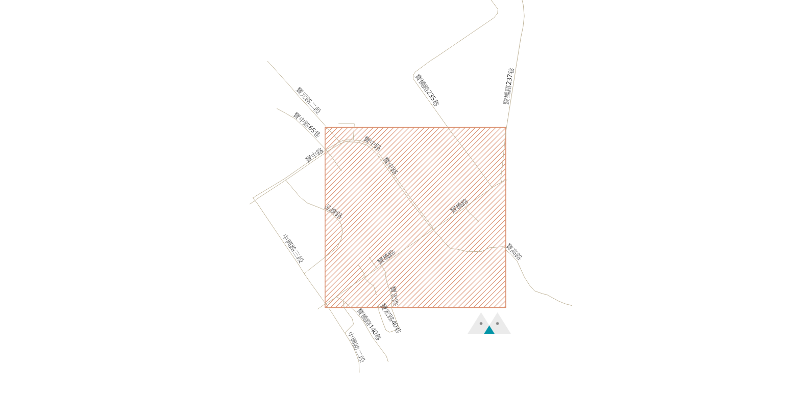
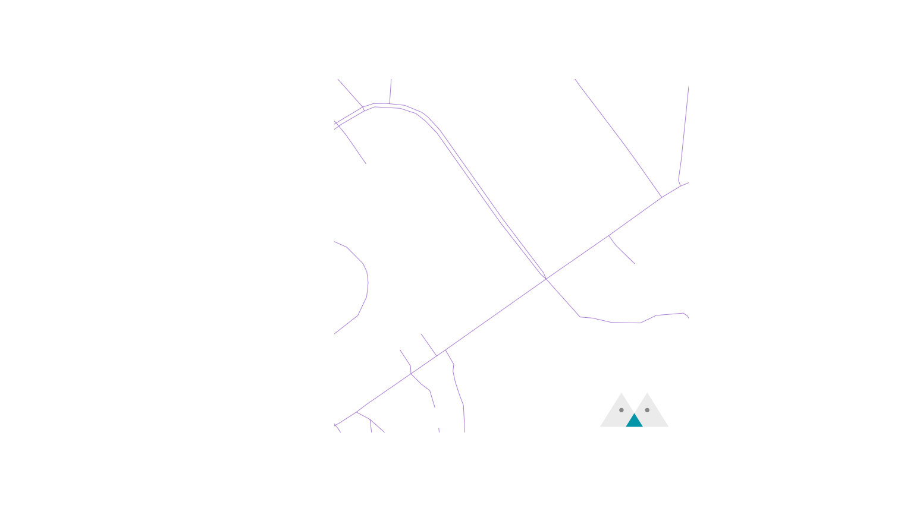

[上一篇文章](../load-osm-data-into-postgis/index.mdx)中，我們了解了 OSM 資料的內容，以及如何將他們導入到 PostGIS 資料庫中供我們使用。現在我們將利用這些資料建立我們的 Vector Tiles API server。


{/* truncate */}

## (選擇性)前置準備事項
我們預計要製作包含行政區域邊界、海洋以及道路的地圖，在開始製作 Tile Server 之前，我們先確定這些資料都準備完成，我把準備資料的 Scripts 放在 Github 上，您可以跟隨我來準備相對應的資；不過，您也可以準備自己的資料，您可以瀏覽過開發流程後使用任何語言來開發。

1. 安裝 [osm2pgsql](https://osm2pgsql.org/) 以及 [ogr2ogr](https://gdal.org/programs/ogr2ogr.html)，我們將用這兩個工具導入資料。
2. 安裝 [Docker](https://www.docker.com/products/docker-desktop/)，我們將利用 Docker 快速啟動 PostGIS。
3. 安裝 [NodeJS](https://nodejs.org/en)，範例程式將會使用 NodeJS 來開發。
4. 下載範例專案。
    ```bash
    git clone git@github.com:oscar60310/tile-server-demo.git && cd ./tile-server-demo
    ```
5. 啟動 PostGIS 以及 [Maputnik](https://github.com/maplibre/maputnik)，我們下篇文章會使用 Maputnik 編輯樣式。
    ```bash
    docker compose up -d
    ```
6. 下載 OSM 資料，使用 OSM 資料須遵守其[規範](https://www.openstreetmap.org/copyright)。這個兩個 Scripts 會導入台灣地區的資料以及海洋的資料，並設定好 PostGIS。
    ```bash
    ./scripts/01_prepare_osm_data.sh
    ./scripts/02_prepare_osm_water_data.sh
    ```
7. 初始化專案。
    ```bash
    npm i
    ```

## 輔助 Function - 座標轉換
我們在第一篇文章中[提到](../how-web-maps-work/index.mdx#%E5%9C%96%E7%A3%9A%E7%B3%BB%E7%B5%B1)，圖磚系統包含了三個參數：Z(Zoom) / X / Y，我們將要在資料庫中時常搜尋某個圖磚所包含的內容，這時候我們可以在資料庫中建立 Function 來幫助我們：
:::info
這個 Helper Function 來自 [Mapbox](https://github.com/mapbox/postgis-vt-util/blob/master/src/TileBBox.sql) 專案。
:::
:::info
這個 Helper Function 已經在 01_prepare_osm_data.sh 建立。
:::

```sql
create or replace function TileBBox (z int, x int, y int, srid int = 3857)
  returns geometry
  language plpgsql immutable as
$func$
declare
  max numeric := 20037508.34;
  res numeric := (max*2)/(2^z);
  bbox geometry;
begin
  bbox := ST_MakeEnvelope(
      -max + (x * res),
      max - (y * res),
      -max + (x * res) + res,
      max - (y * res) - res,
      3857
  );
  if srid = 3857 then
      return bbox;
  else
      return ST_Transform(bbox, srid);
  end if;
end;
$func$;
```
我們使用 `ST_MakeEnvelope` 來建立一個矩形，利用輸入的 Z/X/Y 座標來算出矩形的位置。比如說這個是 `SELECT TileBBox(16, 54895, 28069)` 的結果：


有個這個矩形，我們就可以取出相對應的結果了！

## 取出道路資料
我們先從道路資料開始，道路的資料儲存在 `planet_osm_line` 表中，我們可以使用 `ST_Intersects` Function 來找出和目標圖磚矩形有交會的項目：

```sql
SELECT
  name,
  highway,
  way
FROM
  planet_osm_line
WHERE
  ST_Intersects (TileBBox (16, 54895, 28069), way)
  AND highway IS NOT NULL --- OSM 資料中包含其他線路資料像是公車路網等等，我們暫時不需要他們。
  AND name IS NOT NULL
```
結果如圖：


## 裁切並編碼資料
上一個步驟已經拿到所有和圖磚有交會，也就是需要顯示在圖磚內的道路，但從結果來看可以發現，這些道路很常是超出圖磚的（畢竟興建道路可不是在圖磚上蓋的😂)，我們需要把他們才切成符合圖磚的大小。另一方面，我們將會透過網路傳輸圖磚資料，這時候需要一個有效率的編碼，圖磚的編碼標準已經由 Mapbox [定義](https://github.com/mapbox/vector-tile-spec)，目前大部分的客戶端(負責按照圖磚資料繪製地圖的軟體)都支援這個格式，也就是 Mapbox Vector Tile (MVT)，我們將在 PostGIS 中直接把結果轉為 MVT。
[ST_AsMVTGeom](https://postgis.net/docs/ST_AsMVTGeom.html) Function 可以讓我們輕易地做到這件事情，只需要把結果和圖磚邊界傳給它就好：

```sql
SELECT
  name,
  highway,
  ST_AsMVTGeom (way, TileBBox (16, 54895, 28069)) way
FROM
  planet_osm_line
WHERE
  ST_Intersects (TileBBox (16, 54895, 28069), way)
  AND highway IS NOT NULL --- OSM 資料中包含其他線路資料像是公車路網等等，我們暫時不需要他們。
  AND name IS NOT NULL
```

現在的結果就會是裁切完成的了：


## 取出海洋和行政區邊界的資料
首先，我們可以使用 [ST_AsMVT](https://postgis.net/docs/ST_AsMVT.html) 把多個 MVT 整合在一起，並幫每個 MVT 命名，之後繪圖時我們可以針對不同的 MVT 繪製。接著我們把 API Server 接收到的參數帶進我們的 SQL 查詢中：
:::info
`{{ context.params.x }}` 是 [VulcanSQL](https://vulcansql.com/) 帶入參數的語法，您應該要使用相對應的語法來帶入參數。
這個 SQL 檔案位於專案的 [./sqls/tiles.sql](https://github.com/oscar60310/tile-server-demo/blob/main/sqls/tiles.sql)。
:::

```sql
SELECT
  ST_AsMVT (data.*, 'road') mvt
FROM
  (
    SELECT
      name,
      highway,
      ST_AsMVTGeom (way, TileBBox ({{ context.params.z }}, {{ context.params.x }}, {{ context.params.y }}), 4096, 256, true) way
    FROM
      planet_osm_line
    WHERE
      ST_Intersects (TileBBox ({{ context.params.z }}, {{ context.params.x }}, {{ context.params.y }}), way)
      AND highway IS NOT NULL
      AND name IS NOT NULL
  ) AS data
```
接下來我們可以按照一樣的方式取得海洋(位於 `water` 表中)和行政區域(位於 `planet_osm_polygon` 標中)，我們加入 CTE 來讓 SQL 好讀一些：
```sql
WITH all_data AS (
  SELECT
      'road' AS feature,
      name,
      highway AS category,
      way
    FROM
      planet_osm_line
    WHERE
      highway IS NOT NULL
      AND name IS NOT NULL
    
    UNION
    
    SELECT
      'boundary' AS feature,
      name,
      NULL AS category,
      way
    FROM
      planet_osm_polygon
    WHERE
      admin_level = '4' --- 只取 admin level = 4 的資料
    
    UNION
    
    SELECT
      'water' AS feature,
      NULL AS name,
      NULL AS category,
      way
    FROM
      water
),
tile_data AS (
  SELECT 
    all_data.feature,
    all_data.name,
    all_data.category,
  	ST_AsMVTGeom (all_data.way, TileBBox ({{ context.params.z }}, {{ context.params.x }}, {{ context.params.y }})) way
  FROM
    all_data
  WHERE
    ST_Intersects (TileBBox ({{ context.params.z }}, {{ context.params.x }}, {{ context.params.y }}), all_data.way)
)
SELECT
  ST_AsMVT (tile_data.*, tile_data.feature) mvt
FROM tile_data
GROUP BY tile_data.feature
```
:::warning
我們並沒有很好的處理 Z 很小的時候查詢大量資料的問題，您可以自行決定要如何應對，比如說 Z > 10 才查詢道路等等。
:::

## 啟動 Tile Server
現在，我們已經建立好 API Server 來查詢資料和編碼了，您可以到 [./sqls/tiles.sql](https://github.com/oscar60310/tile-server-demo/blob/main/sqls/tiles.sql) 查看最終結果。

啟動 Tile server：
```bash
npm start
```

測試 Tile server
前往 [http://localhost:3000/api/tiles/16/54895/28069.mvt](http://localhost:3000/api/tiles/16/54895/28069.mvt)，應該要能成功下載檔案。

接下來，我們可以準備繪製地圖了！請參考下篇文章來實作。 

import GisSeries from "../_gis-series.mdx";

<GisSeries />

