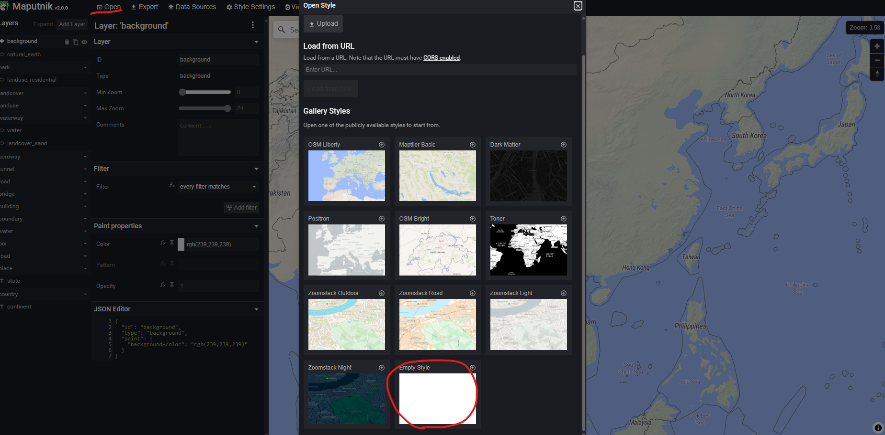
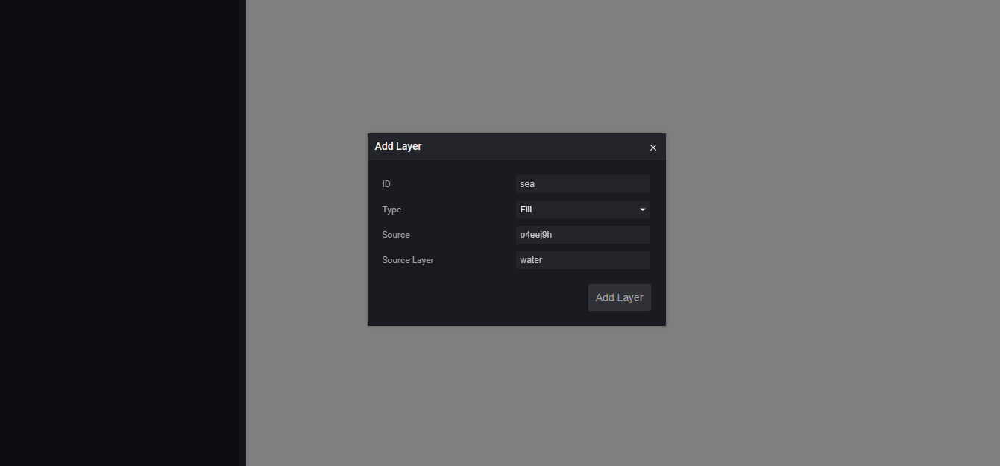
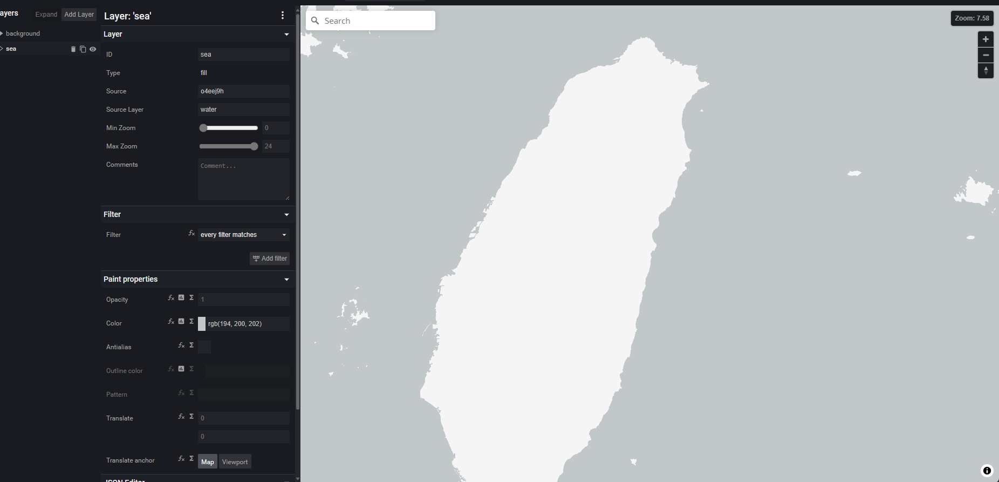
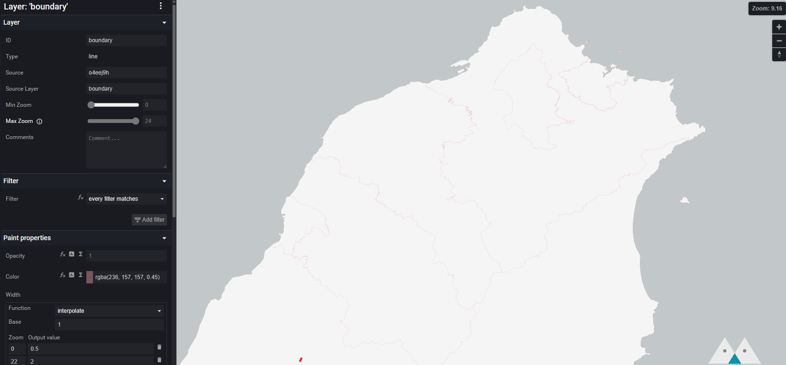
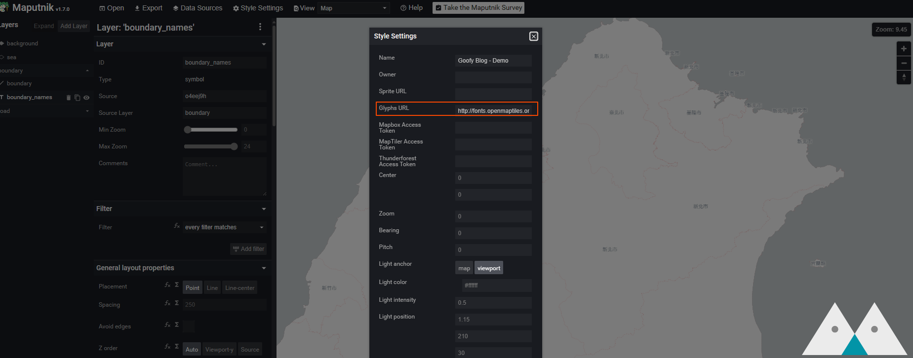
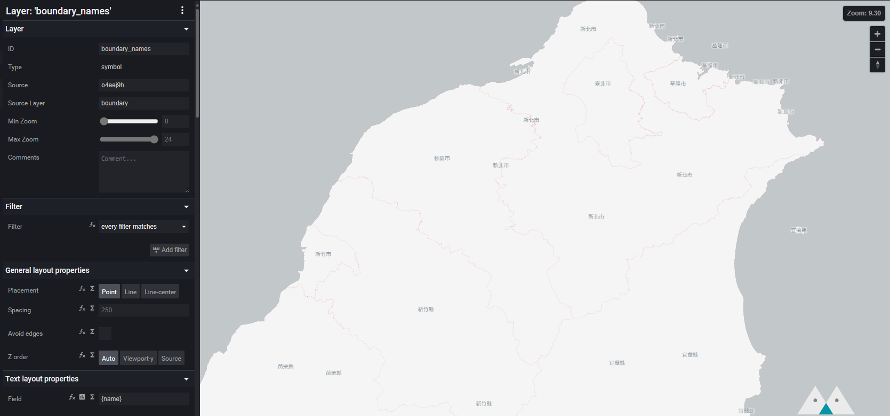
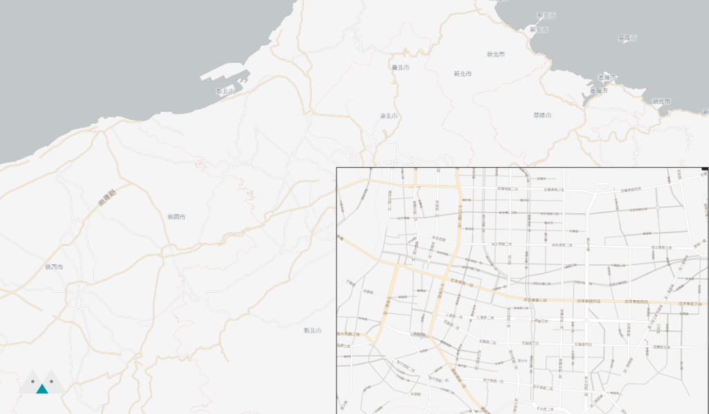

[上一篇文章](../make-your-own-tile-servers/index.mdx)中，我們建立了 Tiles Server，這篇文章是本系列的最後一篇，會把 MVT 的結果在網頁上繪製成地圖。

{/* truncate */}

## 前置準備事項
1. 我們需要能提供 MVT 的 API Server，您可以自行建立，或是按照[上一篇文章](../make-your-own-tile-servers/index.mdx)的指示來下載並部屬範例專案。
2. [Maputnik](https://github.com/maplibre/maputnik)，我們要使用它來編輯樣式，您可以參考官網來安裝，若能已經部屬好範例專案，它已經包含在其中，您可以開啟[http://localhost:8888/](http://localhost:8888/)查看它。

## 加入 Data Source
有了地圖資料之後，我們需要來撰寫樣式，有點像是 CSS，來告訴客戶端該怎麼繪製這些資料。
請開啟 Maputnik [http://localhost:8888/](http://localhost:8888/)，選擇 Open > Empty Style，我們從頭開始製作~

接著，選則 Data Source，加入 Vector (XYZ URLs)，Tile URL 請輸入 `http://localhost:3000/api/tiles/{z}/{x}/{y}.mvt` (或是您自定義的 API Endpoint)。

## 加入海洋圖層
我們先來繪製海洋，按下 Add Layer，ID = sea，Type = Fill，Source = 剛剛建立的 Source，Source Layer = Water。

您可以改變 Paint properties 中的 Color 來讓海洋填充不同顏色，繪製好海洋後，您應該就可以看到陸地的輪廓了(也就是沒有被上色的那些區域)。

## 加入行政區域
按照相同方式，您可以加入行政區域 ID = boundary， Type = Line，Source = 剛剛建立的 Source，Source Layer = boundary。

接著我們把城市名稱也繪製上去，因為要繪製中文的關係，我們需要支援的字形，請按下 Style Settings，設定 Glyphs URL 為 `http://fonts.openmaptiles.org/{fontstack}/{range}.pbf`

加入新的 Layer，ID = boundary_names， Type = Symbol ，Source = 剛剛建立的 Source，Source Layer = boundary。並把 Field 設定為 `{name}` 這是我們 Tile Serevr 提供的資訊，Font 設定為 `Klokantech Noto Sans CJK Regular`。

## 加入道路
最後我們來加入道路，道路的 Layer 為 road，加入的方式和行政區域很像，您可以按照道路等級(我們把等級資訊放在 `category` 欄位)繪製不同顏色的地圖，也可以標註上道路名稱。

您應該可以得到像這樣的結果！

您也可以在這裡[下載](./goofy_blog_demo.json)我做的範例，直接 Import 到 Maputnik 中。

## 利用 MapLibre GL JS 在網頁上繪製地圖
[MapLibre GL JS](https://github.com/maplibre/maplibre-gl-js/)可以根據我們定義的 Style 來在網頁上繪製地圖，您也可以使用不同的 Renderer 在其他裝置像是 iOS, Android 等等繪製地圖，相同的 Style 定義可以用在所有地方。

您可以直接打開範例專案中的 [demo.html](https://github.com/mapbox/postgis-vt-util/blob/master/demo.html) 來查看結果。

## Mapbox vs MapLibre
其實很多標準和工具程式原本都是由 [Mapbox](https://github.com/mapbox) 定義和提供的，但他們在幾年前決定[修改](https://github.com/mapbox/mapbox-gl-js/issues/10162)原本開源專案的授權條款，現在使用 Mapbox libraries 是需要 Token 的，社群於是 Fork 一個版本(還是開源的版本)出來，才形成現在的 [Maplibre](https://github.com/maplibre/maplibre-gl-js)。

----

有關地圖繪製的文章到這邊到一段落了，謝謝你的閱讀，有任何問題請聯絡我😊

import GisSeries from "../_gis-series.mdx";

<GisSeries />

