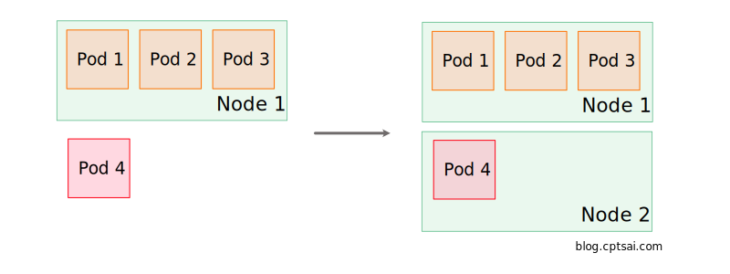
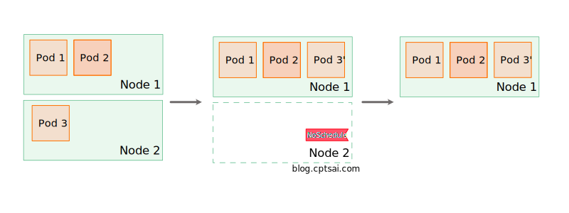
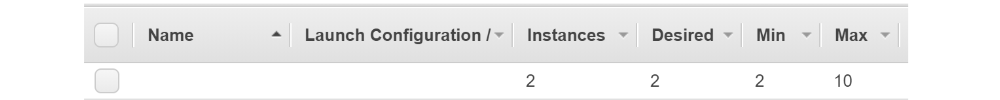

## 甚麼是 Cluster Autoscaler (CA)

Cluster Autoscaler (以下簡稱 CA) 是 Kubernetes 官方出的一個工具，讓你的 Cluster 依照需求伸縮，簡單來說就是幫你開/關雲端上的機器。通常會配合上 [Horizontal Pod Autoscaler](https://kubernetes.io/docs/tasks/run-application/horizontal-pod-autoscale/) (以下簡稱 HPA) 一起使用，當 Pod 記憶體/CPU 或其他指標達到一定標準後，擴展 Pod，當沒有足夠的機器 (Node) 來執行 Pod 時，CA 就會幫你擴展機器。相反的需求下降時，HPA 降低 Pod 數量，CA 也會關閉不需要的機器，如此一來就可以節省成本又可以達到同樣的運算能力。

<!--truncate-->

### HPA

HPA 是 K8S 內建的元件，他監測 Deployment (或 Replication controller 等等) 中資源的使用量，當使用量超過一定標準時 (由使用者定義)，增加 Pod，反之移除不必要的 Pod。

HPA 只會調整 Pod 的數量，他並不會處理群集資源不足的問題，此時就需要 CA 來調整群集大小。

### 擴展原理

CA 其實就是個由 Go 寫成的程式，一樣需要自己部屬在群集中，通常會使用 deployment 並盡可能確保這個程式順上運行，有些雲端方案會將 CA 內建在其中，像是 AKS。

CA 會在兩個時候嘗試調整群集大小：

- 有 Pod 因為資源不足的關係沒辦法執行。
- 有 Node 使用量不足而且上面跑的 Pod 是可以被移動到其他地方的。

當需要放大群集時，他調整機器需求量，讓雲端供應商安排機器，當需要關閉機器時，讓 K8S 驅逐在機器上的 Pod，好讓機器可以安心地關閉，讓我們來看看到底是如何做到的吧！

#### Scale Up

每隔 10 秒 (這個時間可以由 `--scan-interval` flag 來調整) ，CA 會去群集看看 Pod 們的狀態，每當 K8S 沒有辦法將 Pod 順利安排執行環境的時候，會將其狀態設定為 `schedulable = false`，CA 就是在找有沒有這樣的 Pod 存在。

<figure>



<figcaption>Scale up 示意圖</figcaption>
</figure>

找到以後 CA 會看看自己的 Node Group (相同機器的組合，我們可以設定想要的數量和設定，雲端負責準備好這些機器，像是 AWS 中的 Auto scale group，Azure 中的 VMSS)，看有沒有可以放大而且放大以後這個 Pod 可以跑在上面的 (有沒有滿足資源要求、Node Selector) ，有的話就調整 Node Group 大小，並等待機器啟動且加入群集，等 15 分鐘 (這就需要看雲端而定了，通常 3 到 5 分鐘就可以準備完成)，讓 K8S 重新安排這個 Pod 執行。

#### Scale Down

在沒有 scale up 的需求後，CA 會檢查有沒有機會 scale down。當一個 Node 的使用量低於 50% 時 ( CPU 和 Memory )，而且上面的 Pod 們可以被移出，有其他地方適合執行，沒有禁止驅逐，這個 Node 就會被 CA 視為沒有用的 Node，10 分鐘後 CA 會開始把 Node 關閉。

CA 關閉 Node 的方式也很有趣，他會把 Pod 驅逐到別的 Node 上，並在 Node 上加上 [Taint](https://kubernetes.io/docs/concepts/configuration/taint-and-toleration/#taint-based-evictions)，防止 K8S 再把 Pod 排回去。驅逐 Pod 後刪除 Node 的方式就因雲端平台而異了，這部分屬於 [Node Controller](https://kubernetes.io/docs/concepts/architecture/cloud-controller/#node-controller) 的工作。

<figure>



<figcaption>Scale down 示意圖</figcaption>
</figure>

CA 會視情況決定關閉機器的順序以及數量，他會防止同一個時間驅逐過多的 Pod 造成系統不穩定，所以通常會是一台一台關閉，等待系統穩定後再接著判定 Scale Down 條件。

## 與雲端整合

會用到 CA 通常都是在雲端環境，畢竟地端要動態擴展機器不太容易，CA 原本是設計給 GCP 上的 K8S 使用的，現在也已經支援各大平台，像是 Azure、AWS、AliCloud 等等，詳細的支援資料可以查看 [Github - kubernetes/autoscaler](https://github.com/kubernetes/autoscaler/tree/master/cluster-autoscaler#deployment)。這裡我簡單介紹自己有部屬過兩個平台部屬上需要注意的地方：

### AWS

[說明文件](https://github.com/kubernetes/autoscaler/blob/master/cluster-autoscaler/cloudprovider/aws/README.md)

#### 權限設定

在 AWS 上 CA 是和 [Auto Scaling Groups](https://docs.aws.amazon.com/zh_tw/autoscaling/ec2/userguide/create-asg-from-instance.html) (以下簡稱 ASG) 配合使用的，建立好 ASG 或使用 [Managed node groups](https://docs.aws.amazon.com/eks/latest/userguide/managed-node-groups.html) (同樣會產生 ASG，1.14 版本後支援) 後，我們需要給 CA 開一個 IAM Role，並且有這些權限：

```json
{
  "Version": "2012-10-17",
  "Statement": [
    {
      "Effect": "Allow",
      "Action": [
        "autoscaling:DescribeAutoScalingGroups",
        "autoscaling:DescribeAutoScalingInstances",
        "autoscaling:DescribeLaunchConfigurations",
        "autoscaling:SetDesiredCapacity",
        "autoscaling:TerminateInstanceInAutoScalingGroup"
      ],
      "Resource": "*"
    }
  ]
}
```

如果妳的 ASG 有可能需要由 0 個 Node 啟動的話，還需要 `autoscaling:DescribeLaunchConfigurations` 或 `ec2:DescribeLaunchTemplateVersions` 權限，看你的 ASG 使用的是哪一種。因為沒有 Node 時，CA 必須要看 ASG 的設定來推估這個 ASG 會開啟哪一種 VM。

至於要怎麼把權限給 CA 這裡就不多做敘述了，官方的建議作法是使用 [IAM Roles for service accounts](https://docs.aws.amazon.com/eks/latest/userguide/iam-roles-for-service-accounts.html) ，CA 也接受直接傳入 Access ID 和 KEY。

#### 註冊 ASG

權限設定好後接下來就比較簡單了，你可以和 CA 說 ASG 名稱、最小和最大的 Node 數量，CA 會自己判斷什麼時候要調整哪一個 ASG，設定檔案會像這樣 [cluster-autoscaler-multi-asg.yaml](https://github.com/kubernetes/autoscaler/blob/master/cluster-autoscaler/cloudprovider/aws/examples/cluster-autoscaler-multi-asg.yaml)

```yaml
command:
  - ./cluster-autoscaler
  - --v=4
  - --stderrthreshold=info
  - --cloud-provider=aws
  - --skip-nodes-with-local-storage=false
  - --expander=least-waste
  - --nodes=2:10:k8s-worker-asg-1
  - --nodes=1:3:k8s-worker-asg-2
```

需要比較注意的是 CA 不會調整 ASG 的 min/max 數量，所以這裡定義的最大最小值不可以超過 ASG 上設定的，建議可以用 [Auto Discovery](#Auto-Discovery) 來自動偵測，CA 會自動使用 ASG 上的 min/max 來當作最大最小值。

<figure>



<figcaption>AWS ASG 設定畫面</figcaption>
</figure>

#### 多個 ASG

CA 是支援多個 ASG 的，你可以用 node-selector 等方式來限定 Pod 要跑在哪種機器，CA 會知道需要調整哪一個 ASG，你也可以在同一個 ASG 中設定不同類型的 VM ([MixedInstancesPolicy](https://docs.aws.amazon.com/AWSCloudFormation/latest/UserGuide/aws-properties-autoscaling-autoscalinggroup-mixedinstancespolicy.html))，不過有個基本的原則：同一個 ASG 裡面的機器必須有相同的運算資源 ( 比如說 r5.2xlarge 和 r5a.2xlarge 有相同的 CPU 和 Memory )。

### Azure

[說明文件](https://github.com/kubernetes/autoscaler/tree/master/cluster-autoscaler/cloudprovider/azure)

相比 AWS，Azure 的部屬比較容易，但也有些額外的限制。

Azure 的部屬分成三種 VMSS, Standard 以及 AKS，這裡會介紹兩種方式

#### 使用 AKS

首先來說 AKS 部屬，AKS 已經幫你把 CA 內建了，在建立 AKS 的時候加上這些參數就好

```bash
az aks create \
--enable-cluster-autoscaler \
--min-count 1 \
--max-count 3
```

當然你也可以針對每個 Node Pool 設定 CA，請見 [Azure document: Automatically scale a cluster to meet application demands on Azure Kubernetes Service (AKS)](https://docs.microsoft.com/en-us/azure/aks/cluster-autoscaler)。

這種方法非常簡單，你不需要擔心 CA 執行的問題，權限也設定好了，但有幾個個人認為很致命的缺點：

- 目前還不支援 Scale to/from zero，也就是說每一個 Node Pool 都會最少有一個 node 在運作，即使我們根本不需要。(未來會支援 [Github AKS Issue #1565](https://github.com/Azure/AKS/issues/1565))
- CA 不受到你直接控制，需要改 CA 設定比必須藉由更新 AKS，也看不到 CA 的 Log ，增加 Debug 難度。

#### 使用 VMSS

另一種方法就是直接對 Virtual Machine Scale Set ( 類似 ASG ，以下簡稱 VMSS ) 操作，不透過 AKS。部屬方法和 AWS 上差不多，一樣可以直接和 CA 說 VMSS 名稱或者使用 [Auto Discovery](#Auto-Discovery) 自動偵測，不過 VMSS 本身並沒有 min/max 的設定，必須要藉由 `min` 和 `max` 這兩個 tag 來告訴 CA 最大最小值。這和 AWS 運行原理不同，CA 是「有權限」把 VMSS 數量設定到界線之外的 (但他應該不會這麼做)。

至於權限設定和 AWS 很類似，你可以使用像 [aad-pod-identity](https://github.com/Azure/aad-pod-identity) 的元件為每一個 Pod 設定不同的權限，CA 也接受直接提供 [service principals](https://docs.microsoft.com/en-us/azure/active-directory/develop/app-objects-and-service-principals) 資訊。

```yaml
apiVersion: v1
data:
  ClientID: <base64-encoded-client-id>
  ClientSecret: <base64-encoded-client-secret>
  ResourceGroup: <base64-encoded-resource-group>
  SubscriptionID: <base64-encoded-subscription-id>
  TenantID: <base64-encoded-tenant-id>
  Deployment: <base64-encoded-azure-initial-deploy-name>
  VMType: c3RhbmRhcmQ=
kind: Secret
metadata:
  name: cluster-autoscaler-azure
  namespace: kube-system
```

:::info
雖然說這種方法是使用 [aks-engine](https://github.com/Azure/aks-engine) 部屬時用的，但實際測試也可以用在 AKS 上 (不啟用預設的 Auto Scaler)，不過官方文件沒有找到相關的說明。

:::

## 其他技巧

基本介紹和部屬就到這邊了，最後和大家分享一些實用的小技巧。

### Auto Discovery

CA 在 [Azure](https://github.com/kubernetes/autoscaler/blob/master/cluster-autoscaler/cloudprovider/azure/README.md#auto-discovery-setup) 和 [AWS](https://github.com/kubernetes/autoscaler/blob/master/cluster-autoscaler/cloudprovider/aws/README.md#auto-discovery-setup) 都支援使用 Auto dicovery 的方式設定 node，只需要加上 `--node-group-auto-discovery` 這個 flag，並告訴 CA 甚麼 Tag 的 ASG/VMSS 是可以拿來當作 node groups 的，官方建議使用這兩個 tag 確保多個群集可以同時運作。

```yaml
k8s.io/cluster-autoscaler/<YOUR CLUSTER NAME>
k8s.io/cluster-autoscaler/enabled
```

CA 會自動判斷 node groups 的最大和最小值，在 Azure 上必須加上而外的 tag `min` 和 `max`，CA 每隔一段時間會去抓一次 Cloud 上的設定，所以動態設定 Tags/ASG 理論上是可行的。

### Node template

當你的 Node Group 有可能會全數關閉時 (Scale to zero)，Pod 又有特殊的 Node selector 時，我們必須告訴 CA 這個 Node Group 開啟時會產生什麼 label 或 taint。

比如說我們有一個 Pod 下了這樣的 Node Selector：

```yaml
nodeSelector:
  disktype: ssd
```

此時我們必須在對應的 Node Group 上加上特殊的 Tag，稱為 Node Template，以上面的例子為例 Tag 會長的像這樣：

```bash
k8s.io/cluster-autoscaler/node-template/label/disktype=ssd
```

:::caution
在 Azure 中需要把斜線 / 換成底線 \_，因為 Azure tag 不允許有斜線

:::

Taint 也是同樣的道理，需要注意的是 Node Template 是告訴 CA 我的 Node 「將會」有甚麼樣的 Label / Taint ，CA 並不會主動幫 Node 加上這些資訊，還是得靠其他方式加入，例如 EKS 中可以使用 `--kubelet-extra-args` 在啟動時加上資訊 ([詳細資料](https://github.com/awslabs/amazon-eks-ami/blob/master/files/bootstrap.sh))。

### ConfigMap

CA 成功啟動後會在相同的 Namespace 底下建立 configmap `cluster-autoscaler-status`，這裡會有 CA 的最新狀態，[使用 AKS](#使用-AKS) 時這個 configmap 非常實用。

```yaml
$ kubectl get configmap -n kube-system cluster-autoscaler-status -o yaml

status: |+
    Cluster-autoscaler status at 2020-05-10 05:19:13.877534294 +0000 UTC:
    Cluster-wide:
      Health:      Healthy (ready=3 unready=0 notStarted=0 longNotStarted=0 registered=3 longUnregistered=0)
                   LastProbeTime:      2020-05-10 05:19:13.718138783 +0000 UTC m=+1457411.069735333
                   LastTransitionTime: 2020-04-23 08:30:40.150207115 +0000 UTC m=+97.501803660
      ScaleUp:     NoActivity (ready=3 registered=3)
                   LastProbeTime:      2020-05-10 05:19:13.718138783 +0000 UTC m=+1457411.069735333
                   LastTransitionTime: 2020-04-23 08:30:40.150207115 +0000 UTC m=+97.501803660
      ScaleDown:   NoCandidates (candidates=0)
                   LastProbeTime:      2020-05-10 05:19:13.718138783 +0000 UTC m=+1457411.069735333
                   LastTransitionTime: 2020-04-23 08:30:40.150207115 +0000 UTC m=+97.501803660

    NodeGroups:
      Name:        <Node group name #1>
      Health:      Healthy (ready=0 unready=0 notStarted=0 longNotStarted=0 registered=0 longUnregistered=0 cloudProviderTarget=0 (minSize=1, maxSize=2))
                   LastProbeTime:      0001-01-01 00:00:00 +0000 UTC
                   LastTransitionTime: 0001-01-01 00:00:00 +0000 UTC
      ScaleUp:     NoActivity (ready=0 cloudProviderTarget=0)
                   LastProbeTime:      0001-01-01 00:00:00 +0000 UTC
                   LastTransitionTime: 0001-01-01 00:00:00 +0000 UTC
      ScaleDown:   NoCandidates (candidates=0)
                   LastProbeTime:      2020-05-10 05:19:13.718138783 +0000 UTC m=+1457411.069735333
                   LastTransitionTime: 2020-04-23 08:30:40.150207115 +0000 UTC m=+97.501803660
```

## Reference

- [Github - Cluster Autoscaler](https://github.com/kubernetes/autoscaler/tree/master/cluster-autoscaler)
- [Azure - Automatically scale a cluster to meet application demands on Azure Kubernetes Service (AKS)](https://docs.microsoft.com/en-us/azure/aks/cluster-autoscaler)
