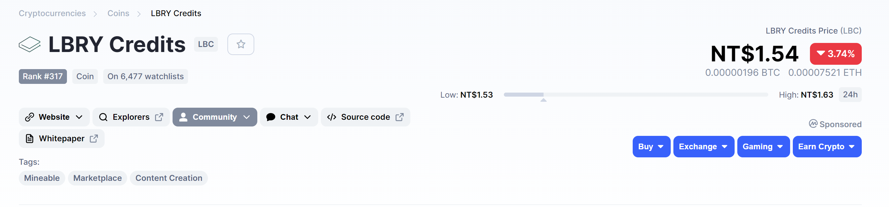

import Image from "@site/src/components/Image";

我最近看到 [好和弦在談論 LBRY](https://youtu.be/62zoHP6p1Lc)，覺得是個很有趣的想法，於是稍微研究了一下官方的 Spec，整理一篇文章來談談 LBRY 的技術內容。

<!--truncate-->

## 甚麼是 LBRY

<Image title="LBRY，圖片來自官網">


</Image>

現在如果我們想上傳一部影片，YouTube 一定是大家的首選，Google 利用大家的資訊，提供廣告商精準的投放平台，讓使用者們可以免費的觀看影片，[分潤](https://support.google.com/youtube/answer/72857?hl=zh-Hant)機制也讓還沒有能力獨立談到業配的 YouTuber 們能有基本的收入。不過隨著 YouTube 越來越大，壟斷的爭議也越來越多，創作者們為了有更多的觸及率，開始製作 YouTube 喜歡的影片，平台開始「審查」影片內容來決定創作者們能否取得收益。

大家開始注意到把所有資訊集中在同一個地方的風險，我們不應該過度相信一家公司，或許我們可以把影片分散放在世界各地，這麼一來就沒有人或公司可以「審核」我們的內容了，於是 LBRY 就誕生了，簡單來說，LBRY 是一個協議，規定一個去中心化資訊交換協定：我要怎麼上傳內容、要怎麼找到內容、要怎麼下載內容等等等，這裡指的內容可能是影片、書籍、圖片等等數位資料。

看到這裡大家可以會覺得很熟悉，這不就是 [BitTorrent](https://en.wikipedia.org/wiki/BitTorrent) 嗎？
沒錯，LBRY 想要構建 P2P + BlockChain 的世界，利用區塊鍊來補足 BT 缺陷。

## 生態系

LBRY 所構想的生態系大致可以由三個層面組成：Blockchain (區塊鍊)、Data Network (資料交換)、Applications (應用)。

### Blockchain

#### 影片資訊 (Metadata)

在 BitTorrent 的世界裡，我們將檔案分割傳給其他人後，會得到種子 (._torrent_)，我們得把這個種子傳給其他人，或是利用 BT 搜尋引擎將種子散播出去，裡面紀錄了這些檔案的資訊，其他人利用這些資訊就可以下載檔案。

在 LBRY 中，這部分被區塊鍊所取代，我們上傳影片後，將影片的資訊寫入區塊鍊中，包括影片名稱、描述、長度、作者等等，以及最重要的檔案 Hash，大家可以藉由這個 Hash 向 Data Network 下載資料 (P2P)，這麼一來，我們不會因為搜尋引擎、論壇倒閉而失去種子資訊。

一個簡略的影片資訊 (claim) 如下，我移除了大部分的內容：
影片 https://odysee.com/@NiceChord:5/feat-aiko:0

```json
{
  "address": "bCtBkaxRkyYmDaWHrsXiZ1NaUtptxvzUfF",
  "amount": "0.01",
  "is_channel_signature_valid": true,
  "signing_channel": {
    "name": "@NiceChord"
  },
  "value": {
    "description": "🎉新的 podcast 節目「好檸檬 NiceLemon」....",
    "languages": ["es"],
    "license": "Copyrighted (contact publisher)",
    "release_time": "1602928826",
    "source": {
      "hash": "6bdb49d045d1b3948b46651bb27d9244b2b9e4f1c929f89af33b27158ad4d10b6d89306f74ff183cb4cffefc4386ae96",
      "media_type": "video/mp4",
      "name": "feat-aiko.mp4",
      "sd_hash": "e27f080636c455f8b8f307cdde80049162f294c65c0a50699a0d08b2148aa1a9626f94a2b27b2aae7cd7856847a640eb",
      "size": "64950543"
    },
    "title": "好和弦教你如何「拉丁風」～ [feat. 蛋餅好朋友 Aiko]"
  }
}
```

其中 sd_hash 是我們可以用來下載檔案的資訊，在發布影片資訊時，我們可以選擇使用 [Channel](https://lbry.tech/spec#channels) 來簽名(也可以不要，匿名發布)，Channel 代表著一個身分，所以在 LBRY 中影片的上傳人是可以被驗證的，上面的資訊中 `is_channel_signature_valid` = true 代表這個資訊已經驗證是由 @NiceChord 發布的，當然這不代表是好和弦本人，但頻道和真人的驗證就不在 LBRY 的規範中了，Application 端可以自行驗證，就像 YouTube 藍勾勾一樣。我覺得這點是和一般 P2P 比起來進步很多的地方，想想在 Fxxx 中，不管什麼檔名的影片全部都是 A 片的狀況 😅。

LBRY 也想到平台抽成的問題，創作者上傳最終還是想要有收入，目前大部分的平台都會向創作者抽取 30% 左右的費用， LBRY 則在區塊鍊中實作了付費功能，你可以將你的內容設定為付費觀看，這麼一來大家想看影片就必須先付費給你(虛擬貨幣)，而且不經由任何平台，只需要付礦工手續費就好。因為儲存在節點中的資料其實是加密的，所以就算我有你的影片區塊，沒有付費獲得金鑰也沒有辦法看，不過要如何避免解密後被再次使用我就不清楚了。

:::info
資訊是寫在區塊鍊上，所以上傳影片(發布影片資訊)，修改影片標題、描述等等都是需要手續費的，不過費用很低，大約是 0.01 LBC。

:::

#### 支付系統

既然都做在區塊鍊上了，那也做個自己的支付系統吧，LBRY 有自己的虛擬貨幣 LBC，所有 LBRY 系統中的交易，包括給創作者的費用，資料交換費用，給礦工的手續費都是支付 LBC，目前 1LBC 大約為 1.54 新台幣 (2020/12)。

<Image title="LBC 價格，來自 coinmarketcap">



</Image>

值得注意的是 LBC 不像是比特幣一樣受到這麼多的關注與認可，就跟所有虛擬貨幣一樣，需要換成法幣(美金，台幣...) 才能真正在生活上使用。想要把 LBC 換成法幣，就必須有對等的人把法幣換成 LBC，畢竟不能無中生有，最終還是需要夠多的人認可整個生態系才能穩定。這跟 YouTube 上收益是不一樣的，畢竟你不會擔心 Google 倒掉害你領不到錢，但虛擬貨幣誰也不能保證。

### Data Network

有了影片資訊後，實際的資料會被分割加密後儲存在網路上的節點中，這部分和 BT 就差不多了，不過在 LBRY 中當節點伺服器是有收益的。

#### 資料市場

當你有一塊資訊內容後 (chunk, 2MB)，你可以跟其他人說：「嘿！我現在有這個塊好東西，他的 Hash 是 xxxxx」，如果有其他人想要的話(剛好是他正在看影片的一部份)，他可以跟你索取檔案。架設節點的人不是做慈善，你可以出價來賣這塊資料，不過會有很多伺服器擁有相同的區塊，所以你也不能隨便亂喊價。

當你付費向其他人取得內容後，你也可以跟其他人說：「嘿！現在我也有這個塊好東西了，大家來跟我買。」，這裡交易的是流量，而不是實際的內容，因為這個區塊會被不斷的複製。

#### Reflectors

當你打算上傳一部影片時，你可以選擇自己做節點，讓別人來你的電腦下載資料，不過這樣你必須 24 小時開機，還需要負荷龐大的上傳流量。不過你有別的選擇：把影片上傳給專業的節點伺服器，由他來幫你提供給其他人 (我們稱為 Reflectors)，這時候就像是傳影片到 YouTube 一樣，你可以從任何地方上傳，完成就可以關機睡覺，不過伺服器就可以到資料市場上賣你的影片內容。

:::caution
在官方 Spec 中，並沒有訂定詳細資料市場的規則，目前線上的節點也沒有遵循這樣的交換協定。

:::

### Applications

下載影片內容需要付費給節點，所以我看影片需要付費囉？
對，也不對ＸＤ。

如果你直接從節點上下載影片的話，你的確需要付流量費用，但在 LBRY 生態系中，還有 Applications (應用層) 的存在。

應用層可以是一個網站平台、手機 APP ...，任何人都可以建立 Application，他要做的事情就是：「付錢給節點下載影片內容，然後給使用者們看」。至於 Application 要怎麼獲得這些費用來支撐營運，LBRY 不管，你要放廣告，要讓大家付費，或是讓創作者花錢提升排序都可以，反正大家都可以是 Application，你亂搞做不好就會被取代掉。

目前比較有名的還是 LBRY 官方的平台，有 https://lbry.tv/ 和 https://odysee.com/。

這應該是 LBRY 的精華所在了，同樣的內容，卻可以由不同的平台來呈現，你可以建立一個原汁原味的平台，資料網路中有甚麼你就呈現什麼，不過這樣可能會有大量的垃圾內容；你也可以建立一個嚴格篩選的平台，只有經過實名認證的使用者上傳的內容才會顯示。

## LBRY 目前未解決的問題

「哇！這們好的技術我怎麼現在才知道，趕快把影片全部移過去。」
「哇！這是賺錢的好機會欸，工程師們趕快動起來！」

先不要ＸＤ，如果真的這麼美好的話，早就有人動手了怎麼會輪到我們。

如前面所說 LBRY 是協定，沒有什麼好壞，但要實際應用還是有許多問題需要解決的，這裡列出我覺得會有問題的地方，有些可能是我的誤解，還請各位幫忙解答：

1. **版權 / 非法內容**
   和 BT 一樣，雖然我們可以驗證發行者，但我們也可以匿名上傳影片。這些非法內容誰要負責？P2P 節點或是 Application？
2. **穩定度**
   LBRY 官方開發了一套工具 [lbry-sdk](https://github.com/lbryio/lbry-sdk) 讓大家可以快速駛用來開發 Application 或是其他服務，不過如果你仔細看 Spec 和程式，你會發現有些出入。比如說前面提到的資料市場，在程式中卻被簡單的邏輯替代，導致目前下載資料都是免費的，作為節點也拿不到任何回饋。(關於這點我有向作者[提問](https://github.com/lbryio/lbry-sdk/issues/3122))
3. **速度**
   BT 下載影片我們可以等，不過需要串流的影片轉個五秒我們應該就受不了，目前節點數量還不多，實際體驗起來沒有很流暢。

## 總結

雖然 LBRY 用的不是甚麼新技術，也還有很多問題需要解決，不過確實是一個非常有趣想法，目前多半是 lbry 官方在貢獻，距離要取代 YouTube 等影音平台還有很長的路 XD。

## References

- [LBRY.com](https://lbry.com/)
- [LBRY Overview](https://lbry.tech/overview)
- [LBRY Spec](https://lbry.tech/spec)
- [Github - LBRY SDK](https://github.com/lbryio/lbry-sdk)
