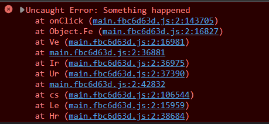
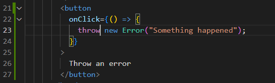

## TypeScript SourceMap

我們可以在 TypeScript 的 [tsconfig.json](https://www.typescriptlang.org/tsconfig#sourceMap) 設定 `comilerOptions.sourceMap = true` 來產生 [Source Map](https://firefox-source-docs.mozilla.org/devtools-user/debugger/how_to/use_a_source_map/index.html) 檔案，這個檔案可以讓 [VS Code](https://code.visualstudio.com/docs/typescript/typescript-debugging)、[Chrome debugger](https://developer.chrome.com/blog/devtools-tips-23/) 等工具把編譯後的 JS 檔案對應回去原始碼 (TS)。

不過如果收到 Production 上回應的 Error Stacks，想要找到對應在 TS 的程式位置，有沒有辦法快速的找到呢？

<!--truncate-->



:::tip
Sentry [支援上傳 SourceMap](https://docs.sentry.io/platforms/node/guides/connect/sourcemaps/uploading/typescript/)，如果公司政策允許的話，上傳 SourceMap 會是比較快速的選擇。
:::

## source-map library by Mozilla

我們可以透過 Mozilla 開發的工具 [source-map](https://github.com/mozilla/source-map) 來產生和讀取 Source Map。

1. 首先，切換到 Production 對應的原始碼版本，在本地產生一份含有 Source Map 檔案的建置。
2. 安裝 source-map，我們可以安裝在 Global folder 以方便使用。
   ```bash
   npm i -g source-map
   ```
3. 使用 source map consumer 來獲得原始碼的位置以及行數。

   ```js title="Node"
   const sourceMap = require("source-map");
   const fs = require("fs");
   sourceMap.SourceMapConsumer.with(
     // replace with your source map file
     JSON.parse(
       fs.readFileSync("./build/static/js/main.fbc6d63d.js.map", "utf-8")
     ),
     null,
     (consumer) => {
       // replace with your line number and column number from error stacks
       console.log(consumer.originalPositionFor({ line: 2, column: 143705 }));
     }
   );
   ```

   ```bash title="Cosnole Log"
   > { source: 'App.tsx', line: 23, column: 18, name: null }
   ```

4. 有檔案名稱和行數後，我們就可以輕鬆地找到原始碼的位置了！
   

## 總結

雖然需要直接讀取 Source Map 的機會不多，大多時候 IDE 或瀏覽器就會幫我們處理好了，但還是留下紀錄給需要的人，希望能幫助到各位！
