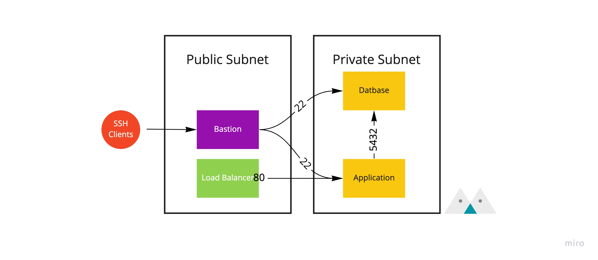
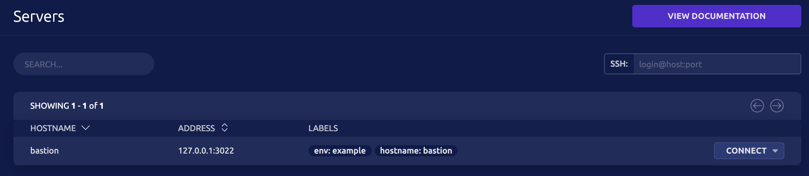
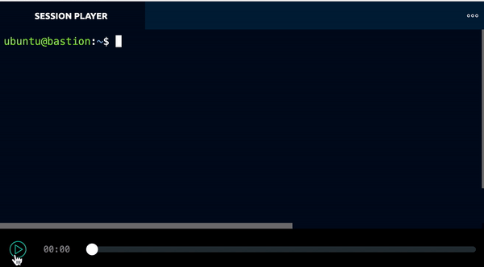
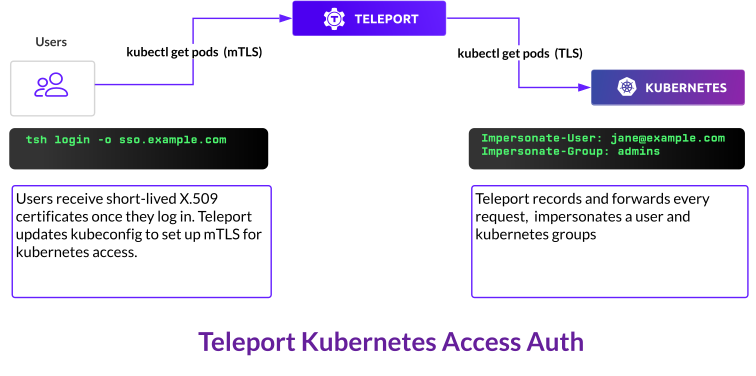

## What is a Bastion Host?

Usually, we place internal services such as databases or applications in private subnets. These machines cannot be accessed directly through a public IP. Instead, we use load balancers (ALB, ELB) to redirect traffic to the internal machines. This setup protects our services from external attacks and only allows access to services that truly need to be exposed externally.<!--truncate--> See the diagram below (typically, applications and databases are not placed in the same subnet):



However, occasionally we still need to SSH into machines in the private subnets for deployment or diagnosis. In such cases, we need an additional "jump server" that allows us to connect to the machines. This server is called a Bastion Host or Jump Server. Its main job is to manage permissions and log connections, so that we can track the data coming in and out of our network.

We can use a Linux host with an SSH server as a jump server directly. The command is as follows:

```bash
ssh -J jump-server private-host
```

However, in this case, we need to manage the public keys and permissions of each user ourselves. [Teleport](https://goteleport.com/) provides us with more powerful features.

## Teleport

Teleport provides four main functionalities:

- Server Access: Similar to an SSH jump host, we can use Teleport to SSH into internal machines.
- Kubernetes Access: We can use Teleport to access the Kubernetes API and services within the cluster.
- Application Access: Allows us to quickly access internal HTTP services. We will not go into detail on this part in this article, as it is less frequently used.
- Database Access: Allows us to directly connect to internal databases through Teleport.

First, we need to install the Bastion Host, and the installation process is straightforward. Follow the instructions on the official website:

[Installing Teleport](https://goteleport.com/docs/installation/)

:::info
If you plan to use Teleport in a production environment, please review the [Teleport Production Guide](https://goteleport.com/docs/production) before deploying. It provides detailed tutorials.

:::

It is important to note that we must install the same package on all machines and use [Roles](https://goteleport.com/docs/cli-docs/#teleport) to switch the roles of the machines. The Bastion Host must have the Proxy role. In a testing environment, we can deploy all roles on the same machine, separated by commas, for example: `--roles=proxy,node,auth`.

### Server Access

SSH is probably the most commonly used feature. The process of joining a node is similar to how Kubernetes works. First, request a join token from Teleport, and then use the token to join the cluster. After that, we can use the Teleport CLI or Web UI to connect to the machines.

[Server Access Getting Started Guide](https://goteleport.com/docs/server-access/getting-started/)



We can directly connect using the Connect button on the UI or via

the CLI:

```bash
tsh ssh ubuntu@bastion
```

We can also use OpenSSH to configure a jump server for connection: [Using Teleport with OpenSSH](https://goteleport.com/docs/server-access/guides/openssh/).

### Access Control

In Teleport, we can use Labels to control access. Teleport supports [RBAC](https://goteleport.com/docs/access-controls/introduction/), which allows us to control members within a group and define which labeled machines can be accessed.

For example, interns can only access machines with the label `env=develop`:

```yaml
kind: role
version: v3
metadata:
  name: intern
spec:
  allow:
    node_labels:
      env: develop
  deny: {}
```

### Auditing

In addition to basic information about which users are connecting to machines, Teleport provides a great feature called [Session recording](https://goteleport.com/docs/architecture/nodes/#session-recording). It records all I/O activities and allows us to replay them directly on the UI.



## Kubernetes Access

Our company has multiple Kubernetes clusters corresponding to different environments. In the past, we had to SSH into the machines or forward the Kubernetes API to use tools like Kubectl for deployment. Teleport provides us with a unified interface to operate multiple clusters. We only need to log in to the specified cluster using the CLI, and Teleport will automatically update the Kubeconfig, allowing us to use tools like Kubectl directly:

```bash
tsh kube login cluster-name
kubectl get pods
```

Similar to Server Access, Kubernetes Access also supports access control. When we send Kubernetes API requests to Teleport, it uses its own generated credentials. After successful authentication, Teleport forwards the requests to the cluster.



To install Teleport on Kubernetes, we need to create a [Teleport Agent](https://github.com/gravitational/teleport/tree/master/examples/chart/teleport-kube-agent) in the cluster. The Agent actively connects to the Proxy server (Bastion) and executes requests on our behalf when we send Kubernetes API requests. The installation of the Agent is simple. Teleport provides Helm Charts for easy installation:

```bash
helm install teleport-kube-agent . \
  --create-namespace \
  --namespace ${TELEPORT_NAMESPACE?} \
  --set roles=kube \
  --set proxyAddr=${PROXY_ENDPOINT?} \
  --set kubeClusterName=${KUBERNETES_CLUSTER_NAME?}
```

If you don't want to install additional components in your environment, you can also write the Kube Config into the Bastion config. However, you must ensure that the Bastion can connect to the target machine's Kubernetes API server. Please refer to [Kubernetes Access from standalone Teleport](https://goteleport.com/docs/kubernetes-access/guides/standalone-teleport/).

### Database Access

The operation of Database Access is similar to Kubernetes Access. We first use Teleport's authentication method to connect to Teleport, and then it forwards requests and applies permissions to the target database. Currently, Teleport supports PostgreSQL and MySQL. If you are using a cloud service database (such as AWS RDS), you only need to configure IAM and provide Teleport with appropriate credentials. Please refer to [Database Access with PostgreSQL on AWS](https://goteleport.com/docs/database-access/guides/postgres-aws/).

If you are using a self-hosted database, we need to change the authentication method to [Certificate Authentication](https://www.postgresql.org/docs/12/auth-cert.html). Teleport cannot directly use User/Pass to log in. This can be a bit more complicated.

Also, if you are using GUI tools to connect to the database instead of default CLI tools like psql or mysql, you need to refer to [Database Access GUI Clients](https://goteleport.com/docs/database-access/guides/gui-clients/) for configuration. Due to the dynamic nature of the private key generated by Teleport, we have found that many tools can be a bit tricky to use.

## Conclusion

Teleport is currently a stable system, so there should be no problem using it in production environments. The ability to use SSO for login and configure permissions is very attractive. In our tests, we did not encounter any issues with Server Access (SSH) and Kubernetes Access. However, if you need to access databases using Teleport, you may need to do further research or wait for Teleport to mature before considering it.

Preview image by **[Syed Hasan Mehdi](https://www.pexels.com/@syed-hasan-mehdi-270838?utm_content=attributionCopyText&utm_medium=referral&utm_source=pexels)** from **[Pexels](https://www.pexels.com/photo/derawar-fort-at-sunset-815880/?utm_content=attributionCopyText&utm_medium=referral&utm_source=pexels)**
