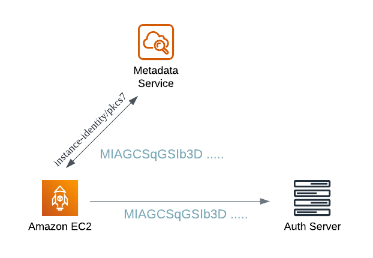

## Instance Metadata Service

Instance metadata is the information provided by AWS about your EC2 instances, including details like Host Name, Public IP, and more. This information can be accessed through the Metadata Service available at `169.254.169.254`. This address is a [link-local address](https://www.wikiwand.com/en/Link-local_address) that can only be accessed from within the EC2 instance. For example, you can retrieve the current Public IP using the following API:

```bash
curl http://169.254.169.254/latest/meta-data/public-ipv4
```

<!--truncate-->

## Instance Identity Documents

Instance identity documents are a type of dynamic instance metadata that is regenerated each time the machine starts or restarts. They contain important information such as:

| Name                    | Description                                                                                                               |
| ----------------------- | ------------------------------------------------------------------------------------------------------------------------- |
| marketplaceProductCodes | Product codes provided by AWS Marketplace, which can be used to verify if the instance is initialized by AWS Marketplace. |
| imageId                 | The ID of the AMI used by the instance.                                                                                   |
| instanceId              | The ID of the EC2 instance.                                                                                               |

Fetching the instance identity documents is straightforward, using the Metadata Service at the same endpoint:

```bash
curl -s http://169.254.169.254/latest/dynamic/instance-identity/document

{
  "accountId" : "xxxxxxx",
  "architecture" : "x86_64",
  "availabilityZone" : "ap-northeast-1d",
  "billingProducts" : null,
  "devpayProductCodes" : null,
  "marketplaceProductCodes" : null,
  "imageId" : "ami-xxxxx",
  "instanceId" : "i-xxxxxx",
  "instanceType" : "t3a.small",
  "kernelId" : null,
  "pendingTime" : "2022-10-15T13:45:28Z",
  "privateIp" : "10.100.2.202",
  "ramdiskId" : null,
  "region" : "ap-northeast-1",
  "version" : "2017-09-30"
}
```

### Authentication with Instance Identity

Can instance identity be used for authentication? The answer is yes. Vault provides a similar [authentication method](https://developer.hashicorp.com/vault/docs/auth/aws#authorization-workflow) based on instance identity.

However, simply having the JSON data above is not enough for authentication. Besides providing the data, AWS signs it with a public certificate. To verify the instance's identity, we need to check the received signed data with the AWS public key.



### Verifying Identity Document

To verify the identity document, first we need to obtain the AWS public key. The public key varies by AWS Region and can be found in the [official documentation](https://docs.aws.amazon.com/AWSEC2/latest/UserGuide/verify-signature.html). After obtaining the public key, we can verify the signature. Here's a simple example using Node.js:

```js
const crypto = require("crypto");

// Signature from http://

169.254.169.254/latest/dynamic/instance-identity/signature
const signature = Buffer.from(`MVIZxx....`, "base64");

// Document from http://169.254.169.254/latest/dynamic/instance-identity/document
const doc = Buffer.from(
  `{
  "accountId" : "xxxxxxx",
  "architecture" : "x86_64",
  "availabilityZone" : "ap-northeast-1d",
  "billingProducts" : null,
  "devpayProductCodes" : null,
  "marketplaceProductCodes" : null,
  "imageId" : "ami-xxxxx",
  "instanceId" : "i-xxxxxxx",
  "instanceType" : "t3a.small",
  "kernelId" : null,
  "pendingTime" : "2022-10-15T13:45:28Z",
  "privateIp" : "10.100.2.202",
  "ramdiskId" : null,
  "region" : "ap-northeast-1",
  "version" : "2017-09-30"
}`,
  "utf-8"
);

const result = crypto.verify(
  "SHA256",
  doc,
  // AWS public key (Other AWS Regions)
  `
-----BEGIN PUBLIC KEY-----
MIGfMA0GCSqGSIb3DQEBAQUAA4GNADCBiQKBgQCHvRjf/0kStpJ248khtIaN8qkD
N3tkw4VjvA9nvPl2anJO+eIBUqPfQG09kZlwpWpmyO8bGB2RWqWxCwuB/dcnIob6
w420k9WY5C0IIGtDRNauN3kuvGXkw3HEnF0EjYr0pcyWUvByWY4KswZV42X7Y7XS
S13hOIcL6NLA+H94/QIDAQAB
-----END PUBLIC KEY-----
`,
  signature
);

console.log(result);
```

## References

- [AWS - Instance Identity Documents](https://docs.aws.amazon.com/AWSEC2/latest/UserGuide/instance-identity-documents.html)
- [Vault - AWS Auth Method](https://developer.hashicorp.com/vault/docs/auth/aws#authorization-workflow)
