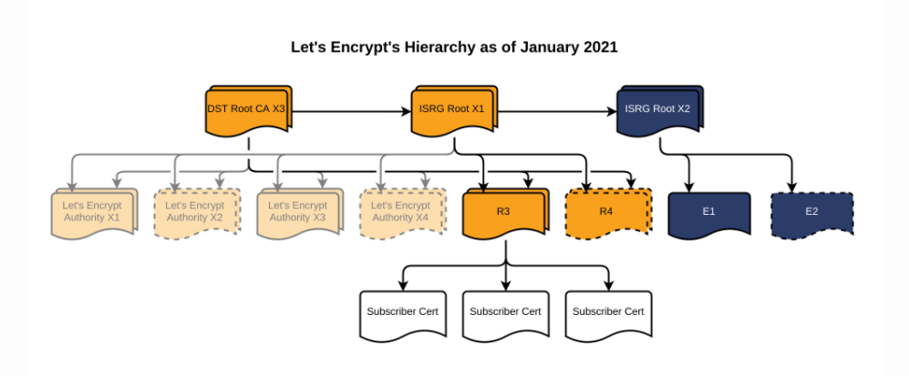
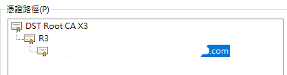

### What are Intermediate Certificates

Generally, a certificate authority (CA) does not issue user certificates using the actual root certificate. After all, there are so many end users, and having the root certificate online every day poses a significant risk. Instead, the CA issues a certificate using the root certificate and then uses that certificate to sign user certificates. This certificate is called an "intermediate certificate."

<!--truncate-->

For example, Let's Encrypt, a well-known CA, currently (May 2021) uses the DST Root CA X3 root certificate and the R3 certificate for signing:

<figure>



<figcaption>Let's Encrypt certificates, image from https://letsencrypt.org/certificates/</figcaption>
</figure>

The path of certificates issued by them looks like this:



After we successfully apply for a certificate and pass the verification, the organization provides us with a certificate (certificate.crt), usually accompanied by a CA Bundle File (ca_bundle.crt). The ca_bundle.crt includes the root certificate and the intermediate certificate, while the certificate.crt contains the server certificate and the intermediate certificate.

Using OpenSSL for verification, we find that having only the certificate.crt is not enough; it must be accompanied by the CA Bundle File.

```bash
$ openssl verify ca_bundle.pem
ca_bundle.pem: OK
$ openssl verify certificate.pem
CN = <your host>
error 20 at 0 depth lookup: unable to get local issuer certificate
error certificate.pem: verification failed
$ openssl verify -CAfile ca_bundle.crt certificate.crt
certificate.crt: OK
```

Different servers require different configurations to complete the certificate chain. For Nginx, for example, it requires us to combine the CA bundle and the certificate into one file:

```bash
$ cat certificate.crt bundle.crt > chained.crt
```

Refer to http://nginx.org/en/docs/http/configuring_https_servers.html#chains for more information.

Once the merged file is placed on the server, everything will work fine.

### What Happens When Intermediate Certificates are Not Configured

https://incomplete-chain.badssl.com/

This is a website with incomplete intermediate certificate configuration (only certificate.crt is provided). Most browsers can still open it without any issues, but when using commands like curl, errors will occur.

```bash
curl https://incomplete-chain.badssl.com/
curl: (60) SSL certificate problem: unable to get local issuer certificate
More details here: https://curl.haxx.se/docs/sslcerts.html

curl failed to verify the legitimacy of the server and therefore could not
establish a secure connection to it. To learn more about this situation and
how to fix it, please visit the web page mentioned above.
```

This is because mainstream browsers like Chrome automatically download intermediate certificates (AIA Fetching), while curl does not. This is also why many people overlook the configuration of intermediate certificates. They think that if the certificate works fine when opened in a browser, then the job is done 😂

### Online Checking

We can use [What's My Chain Cert?](https://whatsmychaincert.com/?incomplete-chain.badssl.com) to help check server configurations. Just enter the host of the server, and you can find out if it is configured correctly. If it's not, you can even download the correct configuration directly (although I recommend checking the CA's official website for a more reliable source).

### References

- https://whatsmychaincert.com/?incomplete-chain.badssl.com
- https://github.com/chromium/badssl.com
- https://medium.com/@superseb/get-your-certificate-chain-right-4b117a9c0fce
- https://help.zerossl.com/hc/en-us/articles/360058295894-Installing-SSL-Certificate-on-NGINX
