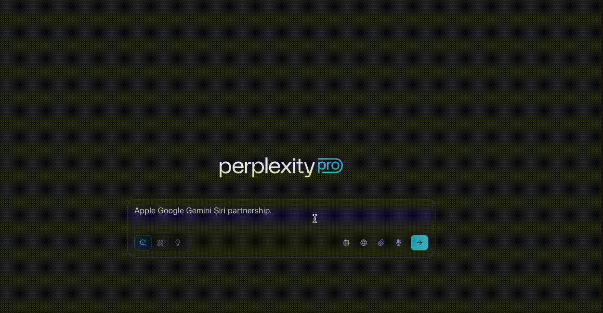
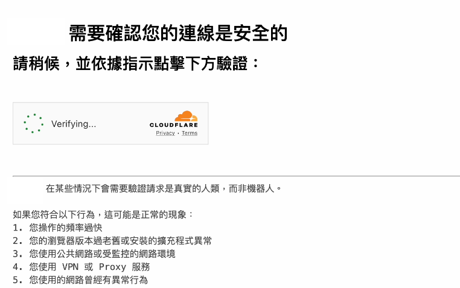

### Introduction

On August 4th, Cloudflare published an article accusing Perplexity of “[stealth, undeclared crawlers to evade website no-crawl directives](https://blog.cloudflare.com/perplexity-is-using-stealth-undeclared-crawlers-to-evade-website-no-crawl-directives/)”. Later the same day, Perplexity published a [response](https://www.perplexity.ai/hub/blog/agents-or-bots-making-sense-of-ai-on-the-open-web), arguing that Cloudflare misunderstood how AI agents operate. This debate isn’t just between two companies—it highlights a growing tension between AI solution providers and content creators.

{/* truncate */}

### What is Perplexity?

[Perplexity](https://www.perplexity.ai/) provides an AI-powered question-answering engine. Similar to ChatGPT, it can answer virtually any question. However, when the model doesn’t have enough pre-trained knowledge, Perplexity “searches” the web in real time to provide more accurate and up-to-date answers.

### What is Cloudflare?

[Cloudflare](https://www.cloudflare.com/) is a company that provides a global network designed to improve website performance and security. Traditionally, users connect directly to a website’s server, but this can lead to high latency and vulnerability to attacks like DDoS.

Cloudflare acts as a **reverse proxy**, sitting between users and the origin server. It delivers content from servers worldwide to reduce latency and blocks abnormal or malicious traffic.

Sometimes, when visiting a Cloudflare-protected website, you may see a page like this:

This is Cloudflare evaluating the request to determine whether to allow it, thereby protecting the website.

### Firewalls and Bots

Websites are visited not only by humans but also by bots. Some, like Googlebot, index websites for search engines—a beneficial activity. Others, often called “bad bots,” may scrape content for malicious purposes.

Cloudflare’s **Web Application Firewall (WAF)** differentiates between “good” and “bad” bots, allowing access to the former while blocking the latter, giving website owners control over content access.

### AI and the “Stealing vs. Indexing” Dilemma

Traditionally, content creators welcomed bots because search engines drove traffic and revenue, often via ads. However, AI changes the equation: AI agents can answer user questions without directing traffic to the original content. This shift has raised concerns among content creators about “stealing” versus “indexing” content.

### Cloudflare’s Claims

In their article, **[Perplexity is using stealth, undeclared crawlers to evade website no-crawl directives](https://blog.cloudflare.com/perplexity-is-using-stealth-undeclared-crawlers-to-evade-website-no-crawl-directives/)**, Cloudflare accused Perplexity of violating web standards:

1. **Ignoring `robots.txt` directives**\
   Website owners can politely request that bots avoid certain pages via `robots.txt`. Good bots respect these directives; malicious bots ignore them. Cloudflare observed that Perplexity’s bots sometimes crawled content even when `robots.txt` requested not to.

2. **Evasive behavior**\
   Legitimate bots declare themselves via a `User-Agent` header. Bad bots may disguise themselves as human browsers to bypass WAF protections. Cloudflare reported that Perplexity’s crawlers sometimes impersonated Chrome on macOS, making it appear as if a human was visiting the site.

Cloudflare concluded that Perplexity’s crawling was **stealthy** and de-listed it as a verified bot, causing their requests to be blocked by the WAF.

### Perplexity’s Response

Being blocked by Cloudflare prevents Perplexity from accessing sites that use Cloudflare. In response, Perplexity argued in [Agents or Bots? Making Sense of AI on the Open Web](https://www.perplexity.ai/hub/blog/agents-or-bots-making-sense-of-ai-on-the-open-web) that AI agents operate differently from traditional bots:

- Traditional bots crawl and store content for indexing, while Perplexity fetches content only in response to a user query and does not store it permanently.
- When fetching content on behalf of a user, AI agents act as user-initiated requests rather than automated crawlers.

Perplexity’s point raises an important question: if AI fetches content only when requested by a user, should it be considered a bot?

### Conclusion

While Perplexity doesn’t explicitly claim to always follow traditional bot rules, their argument introduces a new perspective: AI agents may not fit neatly into the “good bot/bad bot” dichotomy. If AI systems consistently declare their identity, as outlined in [Perplexity’s documentation](https://docs.perplexity.ai/guides/bots), content creators can make informed decisions about allowing AI access.

### References

- [Cloudflare Blog: Perplexity is using stealth, undeclared crawlers to evade website no-crawl directives](https://blog.cloudflare.com/perplexity-is-using-stealth-undeclared-crawlers-to-evade-website-no-crawl-directives/)
- [Perplexity: Agents or Bots? Making Sense of AI on the Open Web](https://www.perplexity.ai/hub/blog/agents-or-bots-making-sense-of-ai-on-the-open-web)
- [Perplexity Crawlers Documentation](https://docs.perplexity.ai/guides/bots)