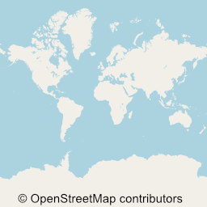
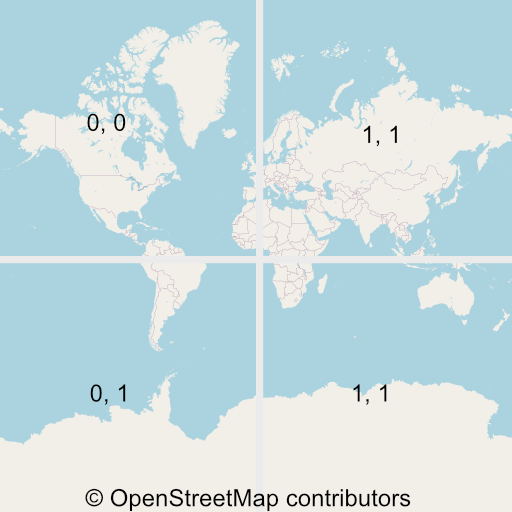
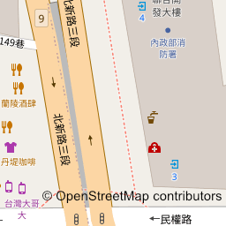
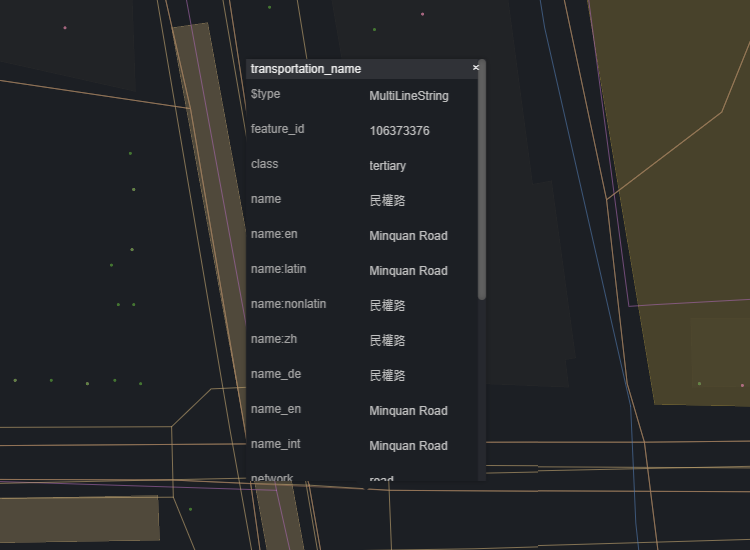
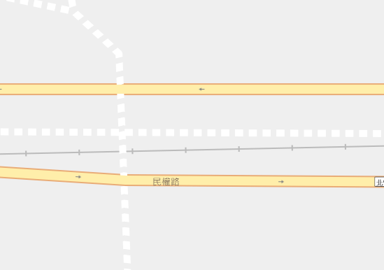

Recently started a new project because I wanted to create online maps using my own data. Services like Google Maps offer limited customization options, so this series of articles will guide you in building your own maps without relying on external services (though map data still needs to be obtained from a provider). It will cover both the backend map database and frontend rendering.

import GisSeries from "../_gis-series.mdx";

<GisSeries />

{/* truncate */}

import MapTiler from '../_maptiler';

<MapTiler url="https://api.maptiler.com/maps/770b1ea1-dd5c-4faa-bac0-9568babe7c12/?key={key}#5.5/23.78510/121.26366" width="100%" />

## Tile System

The earth is round, so to represent it on a 2D plane, it must undergo projection. One common projection method is the [Mercator projection](https://www.wikiwand.com/en/Mercator_projection), and one of its variants is [EPSG:3857](https://epsg.io/3857), which is currently used by Google Maps and OpenStreetMap.

After the projection onto a plane, the next step is displaying it on a webpage. Since the world is vast, it's impractical to provide one large map containing everything. Instead, we can divide the map into smaller pieces called tiles. These tiles can be downloaded as needed, for example, when panning to a specific region or zooming in.

The tile system consists of three parameters: Zoom, X, and Y.

- Zoom represents the zoom level. Starting from 0, it means dividing the world into 2^0 x 2^0 = 1 tile. So, at Z=0, X=0, Y=0, the tile looks like this:

  

- At Zoom = 1, there are 2^1 x 2^1 = 4 tiles. Each tile is typically a 256px square, more tiles allowing higher resolution when rendering:

  

- Tiles with larger Z value can show more details. Here's an example at Z = 19, X = 439151, Y = 224548:

  

Once the tiles are available, the client only needs to fetch the necessary images based on the zoom level and target location, then assemble them to create a basic online map. There are many tile providers, such as OpenStreetMap, which can be accessed using a URL like:

```
https://tile.openstreetmap.org/{z}/{x}/{y}.png
```

:::note
When using OpenStreetMap data, please respect their policy: [OpenStreetMap Tile Usage Policy](https://operations.osmfoundation.org/policies/tiles/).
:::

## Vector Tiles

Traditional maps are indeed composed of images fetched from servers. However, with the increasing performance of client devices, modern maps are transitioning to client-side rendering, akin to the shift from server-side rendering to client-side rendering in frontend development. This series of articles will also use Vector Tiles.

Instead of the server providing complete images, it informs the client about the content within a block and provides style definitions. For example, the sea should be blue, and roads should be gray. The client (webpage, native app) decides how to render the map.

This approach offers numerous advantages, such as:
- Dynamic map generation: Clients can decide how to render, adapting to features like Dark Mode or hiding certain objects.
- Reduced server load: At Z = 19, there would be 274.9 billion tiles worldwide. It's impractical to cache all these images on the server, so they are drawn when requested, resulting in a slower response time.
- Reduced data traffic.

For instance, the server won't directly draw "民權路" but informs the client that within a tile, there's a road named "民權路" classified as tertiary.



The client then draws based on style definitions:
```json
{
  "id": "road_secondary_tertiary",
  "type": "line",
  "source": "openmaptiles",
  "source-layer": "transportation",
  "filter": [
    "all",
    ["in", "class", "secondary", "tertiary"]
  ],
  "layout": {
    "line-cap": "round",
    "line-join": "round"
  },
  "paint": {
    "line-color": "#fea",
  }
}
```

Resulting in a yellow road line:



## Conclusion

This article primarily introduced the tile system. In the upcoming posts, I will delve into topics such as preparing map data, defining styles, transmitting tile data, and rendering maps. Stay tuned for more information!

<GisSeries />

## References
- [Vector tiles introduction - Mapbox](https://docs.mapbox.com/data/tilesets/guides/vector-tiles-introduction/)
