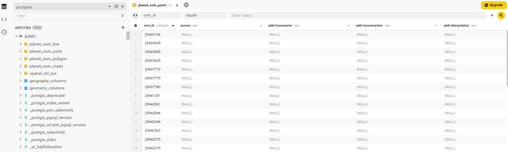
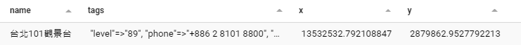

This article will load OpenStreetMap's map data into a Postgres database to facilitate the creation of a Tile Server for our later use.

## OpenStreetMap Data
[OpenStreetMap](https://www.openstreetmap.org/#map=16/24.9878/121.5358) (OSM) is GIS data provider available under an open license. Similar to Wikipedia, anyone can edit and contribute to the data. As long as you credit the data source contributors in your service, OSM data is freely available for use under the [ODbL](https://www.openstreetmap.org/copyright) license.

OSM data includes nodes (buildings, entrances, etc.), ways (routes, areas, etc.), and relations. For example, here's a segment of Zhongshan South Road data, indicating the nodes the route passes through, as well as the name and type of the route.

{/* truncate */}

```xml
 <way id="6183255" visible="true" version="32" changeset="120890621" timestamp="2022-05-12T13:45:49Z" user="user_xxxxx" uid="xxxxx">
  <nd ref="9402564710"/>
  <nd ref="1505012069"/>
  <nd ref="1505012053"/>
  <nd ref="5246621631"/>
  <nd ref="9402530955"/>
  <tag k="highway" v="primary"/>
  <tag k="lanes" v="2"/>
  <tag k="lit" v="yes"/>
  <tag k="moped" v="no"/>
  <tag k="name" v="中山南路"/>
  <tag k="name:en" v="Zhongshan South Road"/>
  <tag k="name:etymology" v="孫中山"/>
  <tag k="name:etymology:wikidata" v="Q8573"/>
  <tag k="name:etymology:wikipedia" v="zh:孫中山"/>
  <tag k="name:nan" v="Tiong-san-lâm-lō͘"/>
  <tag k="name:nan-POJ" v="Tiong-san-lâm-lō͘"/>
  <tag k="name:nan-TL" v="Tiong-san-lâm-lōo"/>
  <tag k="name:zh" v="中山南路"/>
  <tag k="oneway" v="yes"/>
  <tag k="ref" v="9"/>
  <tag k="ref:en" v="Provincial Highway 9"/>
  <tag k="ref:zh" v="台9線"/>
  <tag k="surface" v="asphalt"/>
 </way>
```

As of January 2024, OSM data is approximately 1839 GB. If you only need a portion of the data, such as data for Taiwan, you can download it from [geofabrik.de](https://download.geofabrik.de/asia/taiwan.html) in the [PBF](https://wiki.openstreetmap.org/wiki/PBF_Format) compressed format. This server downloads new OSM data daily and compresses it by region.

## PostGIS
With the map's raw data in hand, the next step is to store it in a database. In this article, we'll use [PostGIS](https://postgis.net/), but you can choose another DB if you prefer. PostGIS is an extension for PostgreSQL that provides many GIS-related functions, indices, and other features.

Refer to its official documentation to install PostGIS into your PG Database, or use a Docker image directly.

```bash
# For demo only, should not be used in production.
docker run --rm -p 5432:5432 -e POSTGRES_HOST_AUTH_METHOD=trust postgis/postgis:16-3.4
```

## osm2pgsql
With a database that supports geographic systems, we still need a tool to import the OSM raw data into the database. Here we'll use [osm2pgsql](https://osm2pgsql.org/), specifically designed to import OSM data into PG. Once installed according to the official documentation, you can use the following command to load the data:

```bash
osm2pgsql -G --hstore -d postgres -U postgres -H localhost -P 5432 ./taiwan-latest.osm.pbf
```

:::info
You may need to install additional extensions to support hstore:
```sql
CREATE EXTENSION hstore;
```
:::

After importing, the database should have four tables starting with `planet_osm`, containing approximately 6.6 million points:



You can try to find data for "Taipei 101 Observatory", including its name, tags, and coordinates:

```sql
SELECT
  name,
  tags,
  ST_X(way) as x,
  ST_Y(way) as y
FROM
  planet_osm_point
WHERE
  osm_id = 4584957701
```



## SRID
You may notice that the coordinates in the data are not in the familiar latitude and longitude format. That's because of differences in the projection coordinate system. You can get the current coordinate system of the data in your database with the following SQL:

```sql
SELECT ST_SRID(way) FROM planet_osm_point WHERE osm_id = 4584957701;
-----------

st_srid 
---------
3857
```

Currently, the data in the database should be in [EPSG:3857](https://epsg.io/3857), with units in meters. This is a commonly used coordinate system in maps, and our tile server will also use it. We can easily convert coordinate systems using PostGIS functions, such as the familiar GPS latitude and longitude [EPSG:4326](https://epsg.io/4326):

```sql
SELECT
  ST_X(latlng),
  ST_Y(latlng)
FROM
  planet_osm_point,
  ST_Transform(way, 4326) AS latlng
WHERE
  osm_id = 4584957701;
---
st_x         |       st_y        
---------------------------------
 121.5648104 | 25.03352480025512
```

## Creating Index
In a tile system, it's common to check if two points intersect, for example, which points are included in tile z=18 x=219591 y=112232. Let's start with a simple example: querying points within 100 meters of Taipei 101:

```sql
WITH taipei_101 AS (
  SELECT ST_Buffer(way, 100) AS way FROM planet_osm_point WHERE osm_id = 4584957701 LIMIT 1
  --- Draw a circle with a radius of 100 meters centered around Taipei 101.
)
SELECT
  name
FROM
  planet_osm_point,
  taipei_101
WHERE
ST_Intersects(taipei_101.way, planet_osm_point.way)
--- Find the points that intersect with the circle we just drew.
```

Without an index, the database scanned all rows (over 6 million data points) to get the result, taking 2.56 seconds. This could be disastrous for a large number of queries. We need to create a spatial index for geographic information.

:::info
osm2pgsql defaults to creating an index for you: "planet_osm_point_way_idx" gist (way) WITH (fillfactor='100'), you can continue to use this index.
:::

[Spatial Indexing](https://postgis.net/workshops/postgis-intro/indexing.html) is different from regular indexing. It first draws bounding boxes and stores them in an R-Tree, enabling quick retrieval of intersecting points.

```sql
--- Creating Spatial Indexing
CREATE INDEX planet_osm_point_way ON planet_osm_point USING GIST (way);
--- Run the previous query again
->  Index Scan using planet_osm_point_way on planet_osm_point  (cost=0.41..10934.48 rows=661 width=47) (actual time=0.109..0.263 rows=208 loops=1)
```

After creating the index, the same query takes only 0.068 seconds.

## Ocean and Lake Data
OSM data does not include oceans and lakes. If you need them, you can download and import data from [Water polygons](https://osmdata.openstreetmap.de/data/water-polygons.html) into your database.

## Conclusion
At this point, we have the necessary data prepared. Next, we'll set up the Tile Server.

import GisSeries from "../_gis-series.mdx";

<GisSeries />

## References
- [Elements - OSM Wiki](https://wiki.openstreetmap.org/wiki/Elements)

