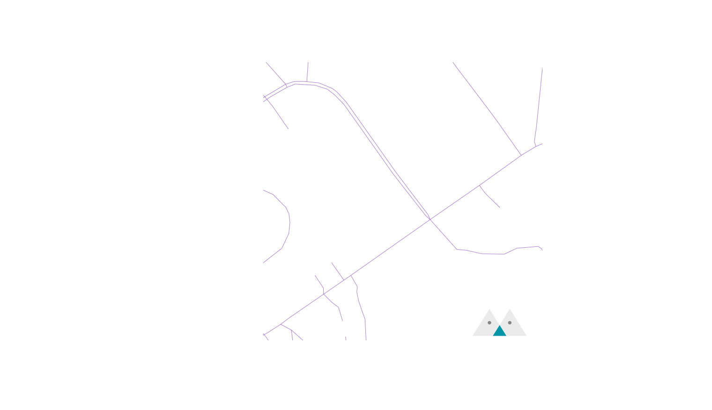

In the [previous article](../load-osm-data-into-postgis/index.mdx), we understood the content of OSM data and how to import them into a PostGIS database for our use. Now, we will use this data to build our Vector Tiles API server.

{/* truncate */}

## (Optional) Preparatory Steps
We plan to create a map containing administrative boundaries, oceans, and roads. Before starting to build the Tile Server, let's make sure these data are ready. I've put the data preparation scripts on GitHub. You can follow along to prepare the corresponding data. However, you can also prepare your own data. You can use any language after browsing through the development process.

1. Install [osm2pgsql](https://osm2pgsql.org/) and [ogr2ogr](https://gdal.org/programs/ogr2ogr.html). We will use these two tools to import data.
2. Install [Docker](https://www.docker.com/products/docker-desktop/). We will use Docker to quickly start PostGIS.
3. Install [NodeJS](https://nodejs.org/en). The example program will use NodeJS for development.
4. Download the sample project.
    ```bash
    git clone git@github.com:oscar60310/tile-server-demo.git && cd ./tile-server-demo
    ```
5. Start PostGIS and [Maputnik](https://github.com/maplibre/maputnik), which we will use in the next article for style editing.
    ```bash
    docker compose up -d
    ```
6. Download OSM data. Use of OSM data must comply with its [license](https://www.openstreetmap.org/copyright). These two scripts will import data of Taiwan and oceans and set up PostGIS.
    ```bash
    ./scripts/01_prepare_osm_data.sh
    ./scripts/02_prepare_osm_water_data.sh
    ```
7. Initialize the project.
    ```bash
    npm i
    ```

## Helper Function - Coordinate Transformation
As mentioned in the first article ([link](../how-web-maps-work/index.mdx#tile-system)), the tile system consists of three parameters: Z (Zoom) / X / Y. We will frequently search for the contents of a tile in the database. At this point, we can create a function in the database to help us:
:::info
This Helper Function is from the [Mapbox](https://github.com/mapbox/postgis-vt-util/blob/master/src/TileBBox.sql) project.
:::
:::info
This Helper Function has already been created in 01_prepare_osm_data.sh.
:::

```sql
create or replace function TileBBox (z int, x int, y int, srid int = 3857)
  returns geometry
  language plpgsql immutable as
$func$
declare
  max numeric := 20037508.34;
  res numeric := (max*2)/(2^z);
  bbox geometry;
begin
  bbox := ST_MakeEnvelope(
      -max + (x * res),
      max - (y * res),
      -max + (x * res) + res,
      max - (y * res) - res,
      3857
  );
  if srid = 3857 then
      return bbox;
  else
      return ST_Transform(bbox, srid);
  end if;
end;
$func$;
```
We use `ST_MakeEnvelope` to create a rectangle, using the input Z/X/Y coordinates to determine the position of the rectangle. For example, this is the result of `SELECT TileBBox(16, 54895, 28069)`:


With this rectangle, we can retrieve the corresponding results!

## Retrieving Road Data
Let's start with road data. Road data is stored in the `planet_osm_line` table. We can use the `ST_Intersects` function to find items that intersect with the target tile rectangle:

```sql
SELECT
  name,
  highway,
  way
FROM
  planet_osm_line
WHERE
  ST_Intersects (TileBBox (16, 54895, 28069), way)
  AND highway IS NOT NULL --- OSM data includes other line data such as bus networks, which we don't need for now.
  AND name IS NOT NULL
```
The result looks like this:


## Clipping and Encoding Data
In the previous step, we obtained all the roads that intersect with the tile, meaning they need to be displayed on the tile. However, from the result, it can be seen that these roads often extend beyond the tile (after all, building roads is not done on tiles 😂). We need to clip them to fit the size of the tile. On the other hand, we will transmit tile data over the network, so we need an efficient encoding. The encoding standard for tiles has been defined by Mapbox [here](https://github.com/mapbox/vector-tile-spec). Most clients (responsible for rendering maps based on tile data) support this format, which is Mapbox Vector Tile (MVT). We will directly convert the result to MVT in PostGIS using the [ST_AsMVTGeom](https://postgis.net/docs/ST_AsMVTGeom.html) function.
This function allows us to easily do this by passing the result and the tile boundary to it:

```sql
SELECT
  name,
  highway,
  ST_AsMVTGeom (way, TileBBox (16, 54895, 28069)) way
FROM
  planet_osm_line
WHERE
  ST_Intersects (TileBBox (16, 54895, 28069), way)
  AND highway IS NOT NULL --- OSM data includes other line data such as bus networks, which we don't need for now.
  AND name IS NOT NULL
```

The result now will be the clipped roads:


## Retrieving Ocean and Administrative Boundary Data
First, we can use [ST_AsMVT](https://postgis.net/docs/ST_AsMVT.html) to integrate multiple MVTs together and name each MVT. Later, when drawing, we can draw based on different MVTs. Then we pass the parameters received by the API Server into our SQL query:
:::info
`{{ context.params.x }}` is the syntax for passing parameters in [VulcanSQL](https://vulcansql.com/), you should use the corresponding syntax to pass parameters.
This SQL file is located in the project's [./sqls/tiles.sql](https://github.com/oscar60310/tile-server-demo/blob/main/sqls/tiles.sql).
:::

```sql
SELECT
  ST_AsMVT (data.*, 'road') mvt
FROM
  (
    SELECT
      name,
      highway,
      ST_AsMVTGeom (way, TileBBox ({{ context.params.z }}, {{ context.params.x }}, {{ context.params.y }}), 4096, 256, true) way
    FROM
      planet_osm_line
    WHERE
      ST_Intersects (TileBBox ({{ context.params.z }}, {{ context.params.x }}, {{ context.params.y }}), way)
      AND highway IS NOT NULL
      AND name IS NOT NULL
  ) AS data
```
Next, we can retrieve ocean data (located in the `water` table) and administrative boundaries (located in the `planet_osm_polygon` table). We add a CTE to make the SQL more readable:
```sql
WITH all_data AS (
  SELECT
      'road' AS feature,
      name,
      highway AS category,
      way
    FROM
      planet_osm_line
    WHERE
      highway IS NOT NULL
      AND name IS NOT NULL
    
    UNION
    
    SELECT
      'boundary' AS feature,
      name,
      NULL AS category,
      way
    FROM
      planet_osm_polygon
    WHERE
      admin_level = '4' --- Only retrieve data with admin level = 4
    
    UNION
    
    SELECT
      'water' AS feature,
      NULL AS name,
      NULL AS category,
      way
    FROM
      water
),
tile_data AS (
  SELECT 
    all_data.feature,
    all_data.name,
    all_data.category,
    ST_AsMVTGeom (all_data.way, TileBBox ({{ context.params.z }}, {{ context.params.x }}, {{ context.params.y }})) way
  FROM
    all_data
  WHERE
    ST_Intersects (TileBBox ({{ context.params.z }}, {{ context.params.x }}, {{ context.params.y }}), all_data.way)
)
SELECT
  ST_AsMVT (tile_data.*, tile_data.feature) mvt
FROM tile_data
GROUP BY tile_data.feature
```
:::warning
We haven't handled well the issue of querying a large amount of data when Z is very small. You can decide how to handle it, such as only querying roads when Z > 10, etc.
:::

## Starting the Tile Server
Now that we have built the API Server for querying data and encoding, you can view the final result in [./sqls/tiles.sql](https://github.com/oscar60310/tile-server-demo/blob/main/sqls/tiles.sql).

Start the Tile server:
```bash
npm start
```

Test the Tile server by navigating to [http://localhost:3000/api/tiles/16/54895/28069.mvt](http://localhost:3000/api/tiles/16/54895/28069.mvt), you should be able to successfully download the file.

------

Next, we can prepare to render the map! Please refer to the [next article](../render-mvt/index.mdx) for implementation.

import GisSeries from "../_gis-series.mdx";

<GisSeries />
