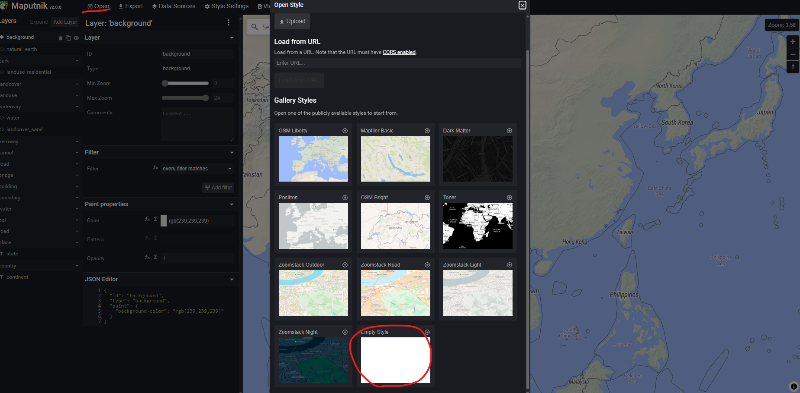
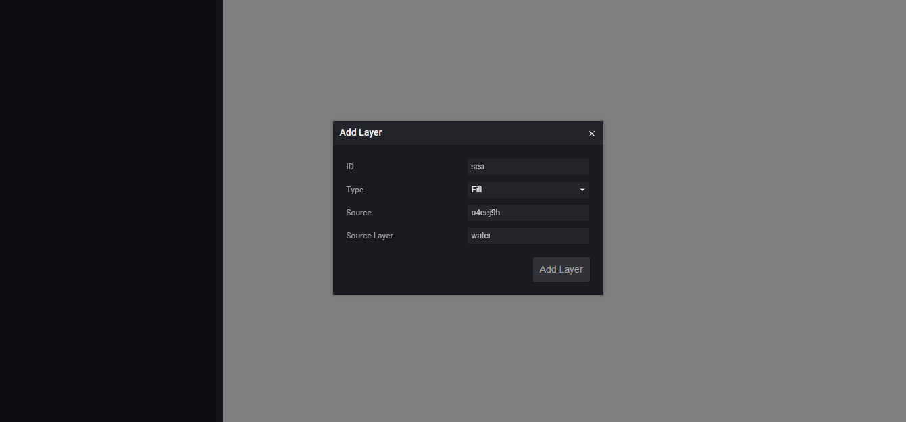
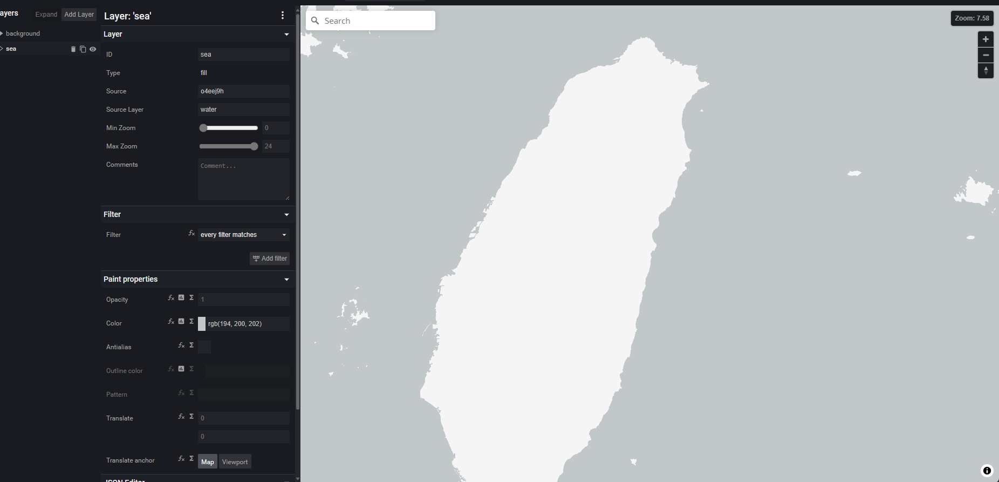
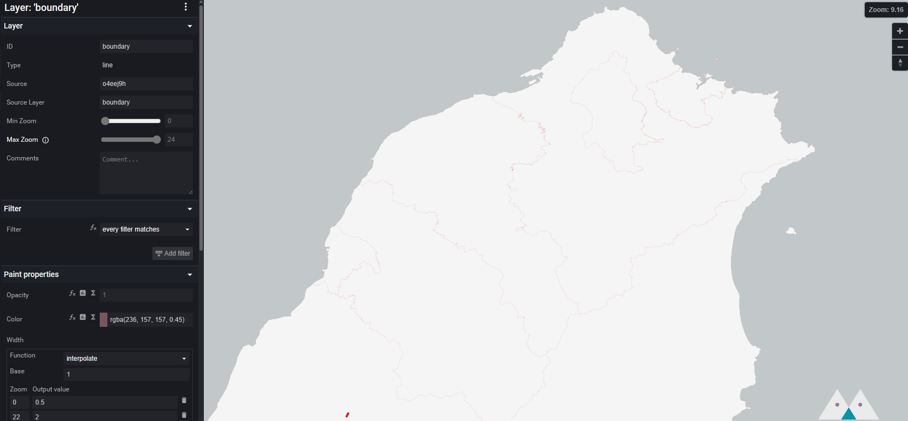
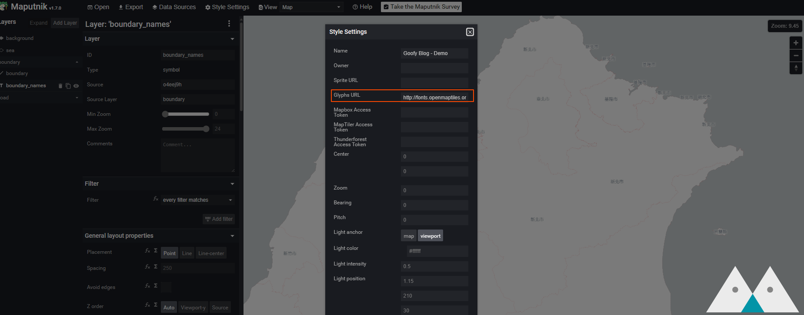
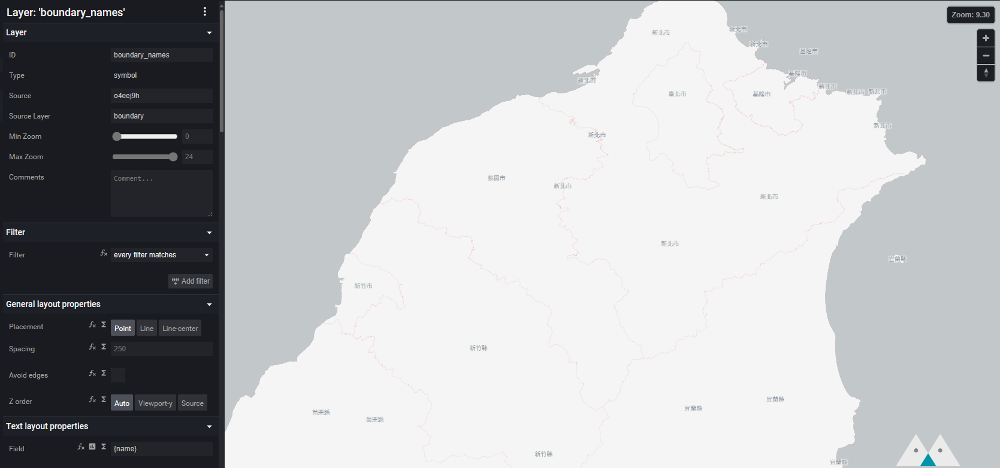
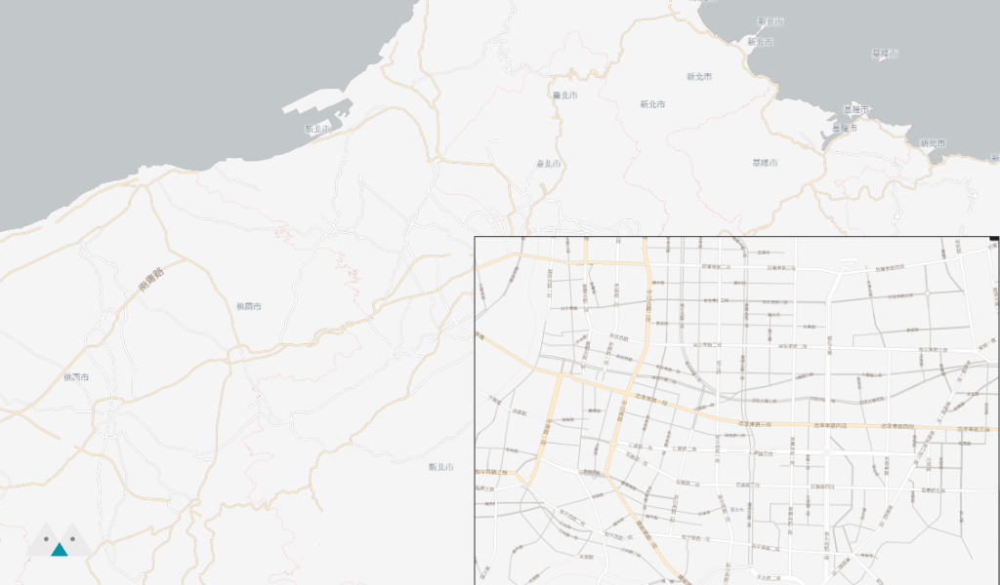

In the [previous article](../make-your-own-tile-servers/index.mdx), we set up a Tiles Server. This article is the final one in this series, where we'll render the results of MVT as maps on a webpage.

{/* truncate */}

## Preparations
1. We need an API Server that can provide MVT. You can create one yourself or follow the instructions in the [previous article](../make-your-own-tile-servers/index.mdx) to download and deploy the example project.
2. [Maputnik](https://github.com/maplibre/maputnik) – we'll use it to edit styles. You can refer to the official website for installation. If you've deployed the example project, it's already included. You can open [http://localhost:8888/](http://localhost:8888/) to access it.

## Adding Data Source
Once we have map data, we need to write styles similar to CSS to tell the client how to render this data. Open Maputnik [http://localhost:8888/](http://localhost:8888/), choose Open > Empty Style to start from scratch.

Then, select Data Source and add Vector (XYZ URLs). Enter the Tile URL as `http://localhost:3000/api/tiles/{z}/{x}/{y}.mvt` (or your custom API Endpoint).

## Adding Ocean Layer
Let's start by drawing the ocean. Click Add Layer, set ID = sea, Type = Fill, Source = the Source we just created, Source Layer = Water.

You can change the Color in the Paint properties to fill the ocean with different colors. After drawing the ocean, you should see the outline of the land (the areas with no color).

## Adding Administrative Boundaries
Similarly, you can add administrative boundaries. Set ID = boundary, Type = Line, Source = the Source we created earlier, Source Layer = boundary.

Next, let's add city names. Since we want to display Chinese characters, we need to support the appropriate fonts. Click Style Settings and set Glyphs URL to `http://fonts.openmaptiles.org/{fontstack}/{range}.pbf`.

Add a new Layer, set ID = boundary_names, Type = Symbol, Source = the Source we created earlier, Source Layer = boundary. Set Field to `{name}` (provided by our Tile Server) and Font to `Klokantech Noto Sans CJK Regular`.

## Adding Roads
Finally, let's add roads. The Layer for roads is road. Adding roads is similar to adding administrative boundaries. You can draw maps with different colors based on road levels (the level information is in the `category` field), and you can also label road names.

You should get a result like this!

You can also [download](./goofy_blog_demo.json) the example I created and import it directly into Maputnik.

## Drawing Maps on the Web with MapLibre GL JS
[MapLibre GL JS](https://github.com/maplibre/maplibre-gl-js/) can render maps on the web based on the Style we define. You can also use different renderers on other devices like iOS, Android, etc. The same Style definition can be used everywhere.

You can directly open [demo.html](https://github.com/oscar60310/tile-server-demo/blob/main/demo.html) in the example project to see the result.

## Mapbox vs MapLibre
Many standards and tools were originally defined and provided by [Mapbox](https://github.com/mapbox). However, a few years ago, they decided to [change](https://github.com/mapbox/mapbox-gl-js/issues/10162) the licensing terms of the original open-source projects. Now, using Mapbox libraries requires a Token. As a result, the community forked a version (still open-source), leading to [Maplibre](https://github.com/maplibre/maplibre-gl-js).

----

This concludes the article on map rendering. Thank you for reading, and feel free to contact me with any questions 😊

import GisSeries from "../_gis-series.mdx";

<GisSeries />
