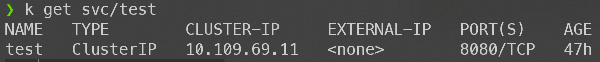
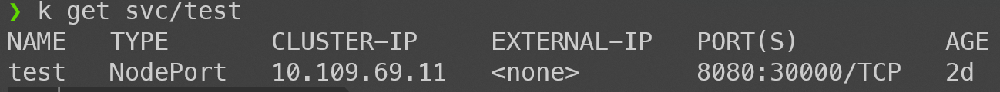
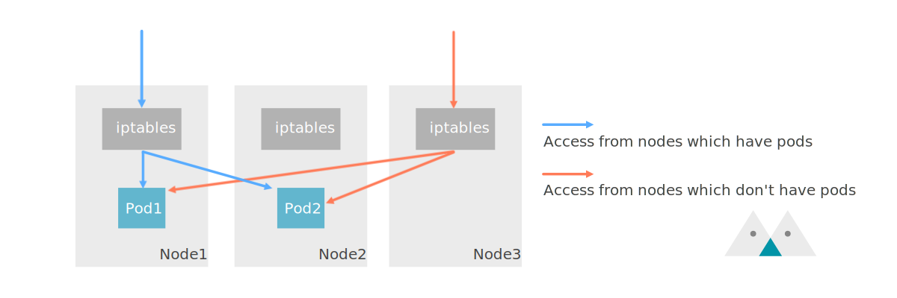
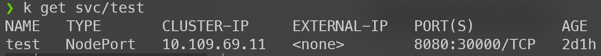
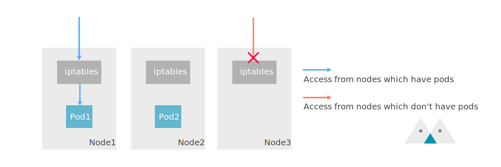
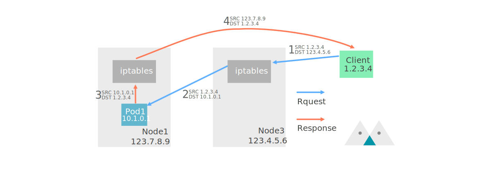
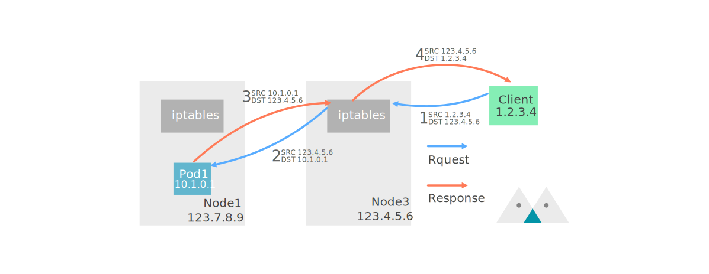
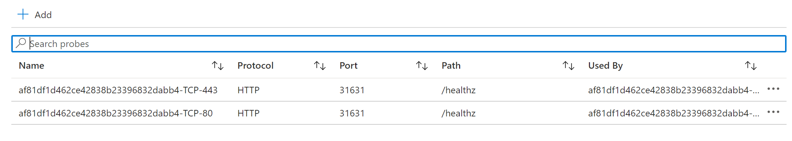
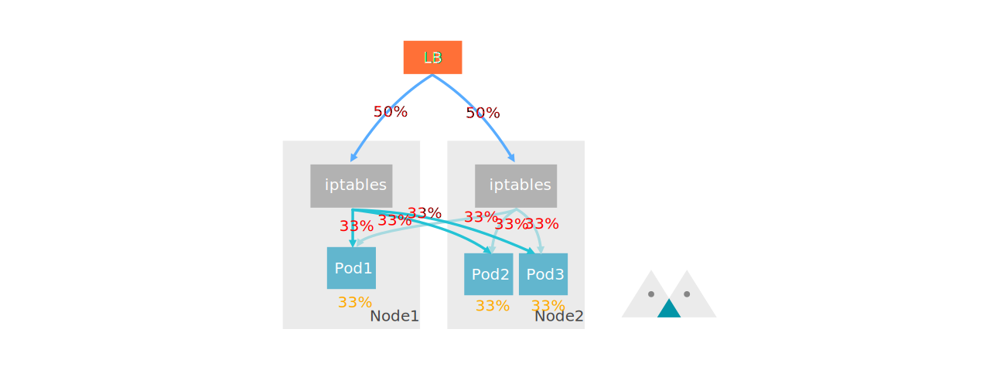

## Introduction

Recently, our company switched to using [Nginx ingress controller](https://kubernetes.github.io/ingress-nginx/) with a L4 Load Balancer to handle incoming traffic, replacing the previous use of [Application Gateway](https://azure.microsoft.com/en-us/services/application-gateway/). During deployment, I discovered that the official default setting for ExternalTrafficPolicy on the Service is set to Local ([Ingress-nginx Azure deploy.yaml](https://raw.githubusercontent.com/kubernetes/ingress-nginx/controller-v0.41.2/deploy/static/provider/cloud/deploy.yaml)), as mentioned in the [AKS documentation](https://docs.microsoft.com/en-us/azure/aks/load-balancer-standard#maintain-the-clients-ip-on-inbound-connections). It was also noted that if we want to preserve the client's source IP address, this configuration is necessary.

After some exploration, it was found that this is related to how Kube-proxy handles incoming traffic, which helped address the implementation issues I had with K8S Service. This article aims to document my findings. 🎉

{/* truncate */}

## Kube Proxy

[kube-proxy](https://kubernetes.io/docs/concepts/overview/components/#kube-proxy) runs on every Node and is responsible for implementing Service functionality. It behaves differently depending on the mode:

In iptables mode, kube-proxy watches the API server and modifies iptables on the Node to achieve packet forwarding. Because it only modifies configurations and relies on the Linux Core to handle packets, its performance is significantly better than in userspace mode.

:::info
For more information about kube-proxy, refer to the documentation on [GKE](https://cloud.google.com/kubernetes-engine/docs/concepts/network-overview?authuser=0#kube-proxy).
:::

Next, let's see what actions kube-proxy takes when different types of Services are created:

### Cluster IP

When the Service type is ClusterIP, internal access to the corresponding Pod can be achieved either through Service DNS or IP. For example:

```yaml
apiVersion: v1
kind: Service
metadata:
  name: test
spec:
  selector:
    app: test
  type: ClusterIP
  ports:
    - protocol: TCP
      port: 8080
      targetPort: 8080
```



kube-proxy will create iptables rules like this:

```bash
KUBE-SVC-IOIC7CRUMQYLZ32S  tcp  --  0.0.0.0/0            10.109.69.11         /* default/test: cluster IP */ tcp dpt:8080

Chain KUBE-SVC-IOIC7CRUMQYLZ32S (1 references)
target     prot opt source               destination
KUBE-SEP-DZ6OGOAFZ2YMFV35  all  --  0.0.0.0/0            0.0.0.0/0            /* default/test: */ statistic mode random probability 0.50000000000
KUBE-SEP-PHU2ZXK3DXEO46Q2  all  --  0.0.0.0/0            0.0.0.0/0            /* default/test: */

Chain KUBE-SEP-DZ6OGOAFZ2YMFV35 (1 references)
target     prot opt source               destination
KUBE-MARK-MASQ  all  --  10.244.1.2           0.0.0.0/0            /* default/test: */
DNAT       tcp  --  0.0.0.0/0            0.0.0.0/0            /* default/test: */ tcp to:10.244.1.2:8080

Chain KUBE-SEP-PHU2ZXK3DXEO46Q2 (1 references)
target     prot opt source               destination
KUBE-MARK-MASQ  all  --  10.244.2.2           0.0.0.0/0            /* default/test: */
DNAT       tcp  --  0.0.0.0/0            0.0.0.0/0            /* default/test: */ tcp to:10.244.2.2:8080
```

When we send data from within the Cluster to the Service (10.109.69.11:8080), it enters the KUBE-SVC-IOIC7CRUMQYLZ32S chain. Then, there is a 50% chance of entering either KUBE-SEP-DZ6OGOAFZ2YMFV35 or KUBE-SEP-PHU2ZXK3DXEO46Q2 (assuming there are two backend Pods). Finally, it goes through DNAT to reach the actual Pod IP.

In this scenario, if it's not a loopback connection, it won't be marked as needing SNAT. Therefore, the application will see the original Pod IP, making the situation much simpler.

### From External NodePort

Here, we discuss two policies: ExternalTrafficPolicy set to Cluster (default) and Local.

Let's assume we have 3 Nodes (Node1, Node2, Node3) and two Pods (Pod1, Pod2), where Pod1 runs on Node1 and Pod2 runs on Node2.

#### ExternalTrafficPolicy = Cluster

This is the default policy. Once established, we can access the Service via NodePort:

```yaml
apiVersion: v1
kind: Service
metadata:
  name: test
spec:
  selector:
    app: test
  type: NodePort
  externalTrafficPolicy: Cluster
  ports:
    - protocol: TCP
      port: 8080
      targetPort: 8080
      nodePort: 30000
```



At this point, we can communicate with Pods from all Nodes on port 30000, even if the Pod is not running on that particular Node. Let's take a look at the iptables:

```bash
Chain KUBE-SERVICES (2 references)
target     prot opt source               destination
KUBE-NODEPORTS  all  --  0.0.0.0/0            0.0.0.0/0            /* kubernetes service nodeports; NOTE: this must be the last rule in this chain */ ADDRTYPE match dst-type LOCAL

Chain KUBE-NODEPORTS (1 references)
target     prot opt source               destination
KUBE-MARK-MASQ  tcp  --  0.0.0.0/0            0.0.0.0/0            /* default/test: */ tcp dpt:30000
KUBE-SVC-IOIC7CRUMQYLZ32S  tcp  --  0.0.0.0/0            0.0.0.0/0            /* default/test: */ tcp dpt:30000

Chain KUBE-SVC-IOIC7CRUMQYLZ32S (2 references)
target     prot opt source               destination
KUBE-SEP-BO7YT2KMVIOH6WRF  all  --  0.0.0.0/0            0.0.0.0/0            /* default/test: */ statistic mode random probability 0.50000000000
KUBE-SEP-QDGUX4VYGOYVANTA  all  --  0.0.0.0/0            0.0.0.0/0            /* default/test: */

Chain KUBE-SEP-BO7YT2KMVIOH6WRF (1 references)
target     prot opt source               destination
KUBE-MARK-MASQ  all  --  10.244.2.5           0.0.0.0/0            /* default/test: */
DNAT       tcp  --  0.0.0.0/0            0.0.0.0/0            /* default/test: */ tcp to:10.244.2.5:8080

Chain KUBE-SEP-QDGUX4VYGOYVANTA (1 references)
target     prot opt source               destination
KUBE-MARK-MASQ  all  --  10.244.2.6           0.0.0.0/0            /* default/test: */
DNAT       tcp  --  0.0.0.0/0            0.0.0.0/0            /* default/test: */ tcp to:10.244.2.6:8080
```

The first part is similar to ClusterIP, except for an additional layer of KUBE-NODEPORTS Chain, ultimately leading to DNAT to the Pod.

What's special is the addition of KUBE-MARK-MASQ within KUBE-NODEPORTS:

```bash
Chain KUBE-MARK-MASQ (15 references)
target     prot opt source               destination
MARK       all  --  0.0.0.0/0            0.0.0.0/0            MARK or 0x4000
```

Finally, in the POSTROUTING stage, packets marked with MARK will have their source IP modified via the MASQUERADE module:

```bash
Chain POSTROUTING (policy ACCEPT)
target     prot opt source               destination
KUBE-POSTROUTING  all  --  0.0.0.0/0            0.0.0.0/0            /* kubernetes postrouting rules */

Chain KUBE-POSTROUTING (1 references)
target     prot opt source               destination
MASQUERADE  all  --  0.0.0.0/0            0.0.0.0/0            /* kubernetes service traffic requiring SNAT */ mark match 0x4000/0x4000 random-fully
```

Because of this modification in the last stage, the Application will see the Node IP instead of the original source. The need for SNAT will be explained later in the article.

This mode would roughly look like this in a graphical representation:

<figure>



<figcaption>NodePort with ExternalTrafficPolicy = cluster</figcaption>
</figure>

For the complete iptables data, please refer to [node-port-cluster-iptables-nat.txt](./node-port-cluster-iptables-nat.txt).

#### ExternalTrafficPolicy = Local

Simply set the Service's externalTrafficPolicy to `Local`. In this case, the Service can only be accessed from the Node where the targeted Pod resides.

```yaml
apiVersion: v1
kind: Service
metadata:
  name: test
spec:
  selector:
    app: test
  type: NodePort
  externalTrafficPolicy: Local
  ports:
    - protocol: TCP
      port: 8080
      targetPort: 8080
      nodePort: 30000
```



At this point, we can only access the Pod from Port 30000 on Node1 and Node2. Node3, having no Pods running on it, cannot establish a connection to the Pod.

Let's first take a look at the iptables on Node1 (with Pod). The difference lies only after the KUBE-NODEPORTS Chain:

```bash
Chain KUBE-NODEPORTS (1 references)
target     prot opt source               destination
KUBE-MARK-MASQ  tcp  --  127.0.0.0/8          0.0.0.0/0            /* default/test: */ tcp dpt:30000
KUBE-XLB-IOIC7CRUMQYLZ32S  tcp  --  0.0.0.0/0            0.0.0.0/0            /* default/test: */ tcp dpt:30000

Chain KUBE-XLB-IOIC7CRUMQYLZ32S (1 references)
target     prot opt source               destination
KUBE-SVC-IOIC7CRUMQYLZ32S  all  --  10.244.0.0/16        0.0.0.0/0            /* Redirect pods trying to reach external loadbalancer VIP to clusterIP */
KUBE-MARK-MASQ  all  --  0.0.0.0/0            0.0.0.0/0            /* masquerade LOCAL traffic for default/test: LB IP */ ADDRTYPE match src-type LOCAL
KUBE-SVC-IOIC7CRUMQYLZ32S  all  --  0.0.0.0/0            0.0.0.0/0            /* route LOCAL traffic for default/test: LB IP to service chain */ ADDRTYPE match src-type LOCAL
KUBE-SEP-SXLTLNYANJJ3YTT4  all  --  0.0.0.0/0            0.0.0.0/0            /* Balancing rule 0 for default/test: */

Chain KUBE-SVC-IOIC7CRUMQYLZ32S (3 references)
target     prot opt source               destination
KUBE-SEP-TMQSCQKS6IHHXYVK  all  --  0.0.0.0/0            0.0.0.0/0            /* default/test: */ statistic mode random probability 0.50000000000
KUBE-SEP-SXLTLNYANJJ3YTT4  all  --  0.0.0.0/0            0.0.0.0/0            /* default/test: */

Chain KUBE-SEP-SXLTLNYANJJ3YTT4 (2 references)
target     prot opt source               destination
KUBE-MARK-MASQ  all  --  10.244.2.8           0.0.0.0/0            /* default/test: */
DNAT       tcp  --  0.0.0.0/0            0.0.0.0/0            /* default/test: */ tcp to:10.244.2.8:8080

Chain KUBE-SEP-TMQSCQKS6IHHXYVK (1 references)
target     prot opt source               destination
KUBE-MARK-MASQ  all  --  10.244.1.10          0.0.0.0/0            /* default/test: */
DNAT       tcp  --  0.0.0.0/0            0.0.0.0/0            /* default/test: */ tcp to:10.244.1.10:8080
```

When traffic enters from Node1's external port 30000, it goes through:

1. KUBE-NODEPORTS
2. KUBE-XLB-IOIC7CRUMQYLZ32S (line 4)
3. KUBE-SEP-SXLTLNYANJJ3YTT4 (line 11)

Directly to the Pod IP. At this point, there's only one Pod. The other Pod, running on Node2, cannot be accessed through Node1.

During this process, there's no MARK, so no SNAT occurs. The applications will see the original IP. This explains why setting the policy to Local is necessary when you want to preserve the client's IP.

:::info
When accessing port 30000 internally from Node1, it follows the normal flow, similar to when the policy is set to Cluster.

:::

In the iptables on Node3, all packets from external port 30000 are discarded because there are no Pods running on that Node. Internal requests remain unaffected.

```bash
Chain KUBE-XLB-IOIC7CRUMQYLZ32S (1 references)
target     prot opt source               destination
KUBE-SVC-IOIC7CRUMQYLZ32S  all  --  10.244.0.0/16        0.0.0.0/0            /* Redirect pods trying to reach external loadbalancer VIP to clusterIP */
KUBE-MARK-MASQ  all  --  0.0.0.0/0            0.0.0.0/0            /* masquerade LOCAL traffic for default/test: LB IP */ ADDRTYPE match src-type LOCAL
KUBE-SVC-IOIC7CRUMQYLZ32S  all  --  0.0.0.0/0            0.0.0.0/0            /* route LOCAL traffic for default/test: LB IP to service chain */ ADDRTYPE match src-type LOCAL
KUBE-MARK-DROP  all  --  0.0.0.0/0            0.0.0.0/0            /* default/test: has no local endpoints */
```

This mode would roughly look like this in a graphical representation:

<figure>



<figcaption>NodePort with ExternalTrafficPolicy = local</figcaption>
</figure>

For the complete iptables data, please refer to [node-port-local-has-no-pod-iptables-nat.txt](./node-port-local-has-no-pod-iptables-nat.txt) (Node3) and [node-port-local-has-pod-iptables-nat.txt](./node-port-local-has-pod-iptables-nat.txt) (Node1)。

## Why do we need SNAT?

When setting ExternalTrafficPolicy to Cluster, traffic undergoes SNAT on the Node before reaching the Pod. Therefore, the source IP seen on the Pod will always be the Node IP. But why does Kube Proxy do this? Let's see what would happen without NAT. For simplicity, let's remove Node2 and assume the client wants to access the service from Node3:

<figure>



<figcaption>Routing without SNAT at arrival node</figcaption>
</figure>

1. The client sends a request to Node3 (assuming there are no Pods running on this Node).
2. Node3 forwards the packet to the Pod IP (only DNAT).
3. The Pod responds.
4. Node1 forwards the packet to the client.

From this illustration, it's clear that although the client sends a request to Node3, it receives a response from Node1. In most cases, this wouldn't work, and the firewall might block it. That's why Kube Proxy makes the Pod respond to the original Node, which is responsible for responding:

<figure>



<figcaption>Routing with SNAT at arrival node</figcaption>
</figure>

Though this introduces extra steps, it ensures smooth routing.

## Load balancer

Now, what happens in a cloud environment when the Service type is LoadBalancer?

Taking AKS (Azure Kubernetes Service) as an example, besides specifying NodePort and adding all Nodes to the LB's Backend pools, a `healthCheckNodePort` is set. This enables Kubernetes to open an additional Health Check Endpoint on this port. We can use this API to check if the Node has the targeted Pod running and control whether the LB should send traffic to this Node. This prevents situations like Node3 in the previous example, where there's no Endpoint.

<figure>



<figcaption>Azure LB health probes configuration</figcaption>
</figure>

## Imbalance

Lastly, let's discuss the biggest challenge faced with using the Local Policy: `imbalance`. Typically, external traffic is evenly distributed across all Nodes by a Load Balancer. Suppose we have two Nodes (Node1, Node2) running a total of three Pods, with one on Node1 and two on Node2.

With the default settings, the situation should look like this:

<figure>



<figcaption>Azure LB Network weight in Cluster Policy</figcaption>
</figure>

Each Pod receives an even 33% of traffic. But what about with the Local Policy?

<figure>


<figcaption>Network weight in Local Policy</figcaption>
</figure>

Since the LB weight for each Node is the same, Pod1 ends up with 50% of the traffic, while the other two only receive 25%. This is what's known as the imbalance issue.

This problem can be addressed by using Pod Affinity to ensure an equal number of Pods on each Node.

## Conclusion

That's all for the discussion on External Traffic Policy. I didn't expect such complexity from a single attribute, but thanks to the efforts of predecessors, we can solve everything with just one configuration line 💗

If you have any concerns about the article, feel free to leave a comment below or open an issue on GitHub. Thank you very much!

## References

- [Kubernetes - Using Source IP](https://kubernetes.io/docs/tutorials/services/source-ip/)
- [Kubernetes - Create an External Load Balancer](https://kubernetes.io/docs/tasks/access-application-cluster/create-external-load-balancer/)
- [A Deep Dive into Kubernetes External Traffic Policies](https://www.asykim.com/blog/deep-dive-into-kubernetes-external-traffic-policies)
- [kubernetes 的 Kube-proxy 的 iptables 转发规则](https://blog.csdn.net/qq_36183935/article/details/90734847)
- [GKE - Network overview](https://cloud.google.com/kubernetes-engine/docs/concepts/network-overview?authuser=0)

Preview image - Photo by **[Brett Sayles](https://www.pexels.com/@brett-sayles?utm_content=attributionCopyText&utm_medium=referral&utm_source=pexels)** from **[Pexels](https://www.pexels.com/photo/routers-with-cables-2425567/?utm_content=attributionCopyText&utm_medium=referral&utm_source=pexels)**