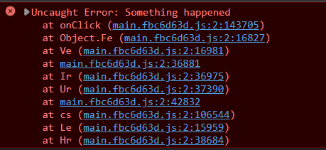
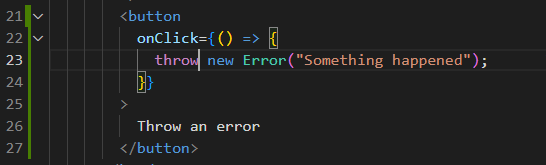

## TypeScript SourceMap

We can generate [Source Map](https://firefox-source-docs.mozilla.org/devtools-user/debugger/how_to/use_a_source_map/index.html) files in TypeScript by setting `compilerOptions.sourceMap = true` in the TypeScript configuration [tsconfig.json](https://www.typescriptlang.org/tsconfig#sourceMap). This file allows tools like [VS Code](https://code.visualstudio.com/docs/typescript/typescript-debugging) and [Chrome debugger](https://developer.chrome.com/blog/devtools-tips-23/) to map the compiled JS files back to the original TypeScript (TS) code.

However, if you receive error stacks from a production environment and want to quickly find the corresponding positions in the TS code, is there a way to do it manually?

<!--truncate-->



:::tip
Sentry [supports uploading Source Maps](https://docs.sentry.io/platforms/node/guides/connect/sourcemaps/uploading/typescript/). If your company policies allow, uploading Source Maps can be a faster choice.
:::

## source-map library by Mozilla

We can use the [source-map](https://github.com/mozilla/source-map) tool developed by Mozilla to generate and read Source Maps.

1. First, switch to the version of the source code corresponding to production and build it locally with a Source Map file.
2. Install the source-map tool. You can install it globally to use for all projects.
   ```bash
   npm i -g source-map
   ```
3. Use the source map consumer to obtain the location and line number of the original code.

   ```js title="Node"
   const sourceMap = require("source-map");
   const fs = require("fs");
   sourceMap.SourceMapConsumer.with(
     // replace with your source map file
     JSON.parse(
       fs.readFileSync("./build/static/js/main.fbc6d63d.js.map", "utf-8")
     ),
     null,
     (consumer) => {
       // replace with your line number and column number from error stacks
       console.log(consumer.originalPositionFor({ line: 2, column: 143705 }));
     }
   );
   ```

   ```bash title="Console Log"
   > { source: 'App.tsx', line: 23, column: 18, name: null }
   ```

4. With the file name and line number, you can easily find the position in the original source code!
   

## Summary

Although the need to manually read Source Maps is rare since IDEs or browsers usually handle it for us, it's still valuable to know the process for those who require it. I hope this information is helpful to you all!
