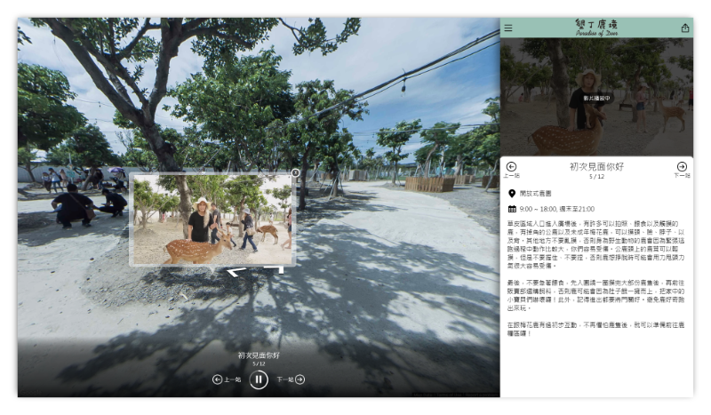

## Ivan Tsai

你好，我是 Ivan

我熟悉 JS 前後端開發以及雲端部屬，目前為全端工程師，喜歡學習與分享新的技術。

### 競賽 / 成就

#### Google Mobile Web Specialist

2019 - 2022，這是一項由 Google Developer 主持的[認證](https://developers.google.com/training/certification/mobile-web-specialist/)，用來測試行動網頁開發技術。

我的認證 - [https://www.credential.net/xh0j2ccc](https://www.credential.net/xh0j2ccc)

#### DevDays Asia 2017 Chatbot 開發大賽

Chatbot 在當時正在起步，所以我們建立了一個服務讓人們可以藉由簡短的對話來安排他們的行程，使用 Google Place 等景點資料來源。雖然現在看來他是個糟糕的想法，透過 Chatbot 似乎沒有比直接使用網站來的直覺，但這仍然是個與使用者互動一個創新的方式，我們最終進入決賽。

[Channel9 錄影](https://channel9.msdn.com/Events/OpenSourceTW/DevDays-Asia-2017/AIContest2017)

#### 新北市樂齡程式開發大賽 - 銅獎

我們想要藉由共享住宿，增加年輕人與長者的互動，於是提出並實作了**忘年之交**這個平台。使用者個以藉由交換勞力、技能或房屋空間，來達到互利的目標。

[新聞報導 Newtalk](https://newtalk.tw/news/view/2017-10-21/101204) / [競賽簡報](https://www.dropbox.com/s/0d9vcmybgi8z6te/15_%E6%96%B0%E5%8C%97%E6%A8%82%E9%BD%A1%E5%A4%A7%E8%B3%BD_%E7%B0%A1%E5%A0%B1.pptx?dl=1)

#### 2016 HackNTU - Social Design 組第一名

在為期三天的⿊客松與團隊發想並建⽴輔導⼈們使⽤各種⼿機應⽤程式的平台，獲得第⼀名。

[競賽簡報](https://www.dropbox.com/s/p17akxr8eeqid05/13_%E5%8F%B0%E5%A4%A7%E9%BB%91%E5%85%8B%E6%9D%BE_%E7%B0%A1%E5%A0%B1.pptx?dl=1) / [Source Code](https://github.com/oscar60310/hackntu)

#### 2015 台北市政府「雲端即時開放資料服務」競賽 - 入圍

利用台北市政府開放資料以及微軟的雲端服務 (Azure web service, machnine learning studio) ，完成停車場即時資料以及預測空間查詢平台，在[競賽](https://news.microsoft.com/zh-tw/2015-11-16_%E8%87%BA%E5%8C%97%E5%B8%82%E6%94%BF%E5%BA%9C%E5%85%A8%E6%96%B0%E3%80%8C%E9%9B%B2%E7%AB%AF%E5%8D%B3%E6%99%82%E9%96%8B%E6%94%BE%E8%B3%87%E6%96%99%E6%9C%8D%E5%8B%99%E3%80)中獲得入選。

[Source Code](https://github.com/oscar60310/tpcar)

## Projects

### Adventrip

提供使用者或企業分享旅程紀錄的平台。

我們創造了分享旅程的另外一種方式，結合文字解說、圖片、影片和街景畫面。不只有一般使用者，場域商家也可以藉由我們的平台推出官方版本，讓更多人了解他們的旅遊景點。

平台使用照片的 EXIF 資料、GPS 紀錄以及其他有用的資訊來判斷拍攝的位置，自動和 Goolge Map 街景或是我們拍攝的街景對應，上傳照片後即可產出專屬的紀錄。

合作夥伴們可以決定特定旅程的主題 (背景畫面、主題顏色等等)，下面是其中一個演示案例

[https://view.adventrip.net/web/hoteldedeer](https://view.adventrip.net/web/hoteldedeer)

### 台鐵列⾞資訊查詢

2014 - 2019 查詢台鐵列⾞時刻的 Android APP，可即時或離線查詢，獲得 2 萬次的下載次數和 4.63 星的評分。目前台鐵官方已經有釋出 API 以及應用程式，再透過第三方程式來讀取已經沒有必要，所以暫時將 APP 下架。

官方網站 - [https://sites.google.com/site/twrailsearch/](https://sites.google.com/site/twrailsearch/)

## 能力

- Front End - [Angular(2+)](https://angular.io), [React](https://reactjs.org), [RxJs](https://rxjs-dev.firebaseapp.com/), [Redux](https://chentsulin.github.io/redux/index.html), [Typescript](https://typescriptlang.org/docs/home.html)
- Back End - [NodeJs](https://nodejs.org/en/), [.NET](https://docs.microsoft.com/en-us/dotnet/), [kubernetes](https://kubernetes.io/)

## 聯絡資訊

- Email: [oscar60310@gmail.com](mailto:oscar60310@gmail.com)
- Github: [oscar60310](https://github.com/oscar60310)
- linkedin: [oscar60310](https://www.linkedin.com/in/oscar60310/)
- Gitlab: [oscar60310](https://gitlab.com/oscar60310)

## 有關這個部落格

The template of this blog is from [mzlogin.github.io](https://github.com/mzlogin/mzlogin.github.io), thanks a lot.

This site using [Hexo](https://hexo.io/) and hosting on Github Pages, you can find the source code at [github project](https://github.com/oscar60310/blog), any issue and folk is welcome.
